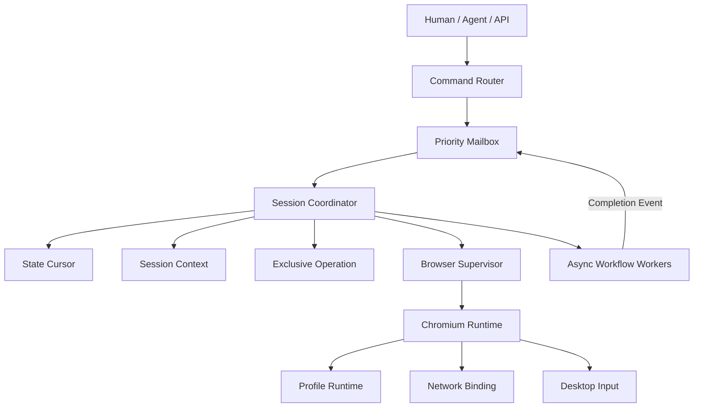

# Agent Browser Cloud / Chromium Runtime Platform 架构设计
## V16 最终版：安全威胁模型、治理闭环与生产运营

> V16 是最终架构版。在 V15 的版本治理、权限拆分和商业运营基础上，正式补齐 Security Threat Model、Prompt Injection 防护、External Content Trust Boundary、State Data Classification、Runtime Provider Sandbox、Proxy Quality/Cost Learning、Business Recovery Validator、Browser Operator、分层 Rate Limit、Recovery GameDay、Compliance Service、团队职责与 RACI、Incident Response，以及这些能力对应的数据表、API、消息协议、Kubernetes CRD、验收标准和剩余风险。
>
> 本版重点解决：
>
> - Coordinator Actor Mailbox 拥塞和阻塞 I/O；
> - Actor 崩溃后的状态重建与短暂双主；
> - Context Epoch 变化过于频繁导致 Agent 重规划风暴；
> - DOM Diff 截断造成服务端 Current State 永久损坏；
> - 远程桌面 Key Up / Mouse Up 丢失；
> - Extension 隐性资源消耗导致节点容量误判；
> - Profile Flush 与 Hang Detection 冲突；
> - 观测数据、视频、Trace 和截图成本膨胀；
> - Chromium Fork 的长期维护人力边界；
> - Challenge Detection、用户授权点击和自主 Agent 之间的权限隔离。
>
> 本平台面向合法的浏览器自动化测试、远程浏览器、企业流程、Agent 辅助操作和会话隔离。安全挑战可以被自动检测和上报；单次点击必须由用户对当前 Challenge Event 明确授权。平台不提供无人值守的 CAPTCHA 求解、自动多轮挑战试探或面向特定安全系统的自适应规避策略。

---

# 1. 产品定位

本项目定义为：

> **以受控 Chromium Runtime 为核心，提供有状态 Agent、远程桌面、Profile 持久化、网络隔离、Runtime 插件化和高密度调度的 Browser Infrastructure Platform。**

核心能力：

- Chromium Runtime Registry
- Browser Runtime SDK
- Session Coordinator
- Browser Supervisor
- Agent Runtime
- Browser State Engine
- Unified Input Runtime
- Human-Directed Assist
- Challenge Detection
- Fingerprint Runtime
- Shared Egress Gateway
- Profile Storage Service
- Extension Runtime Manager
- Browser Density Engine
- Remote Desktop Gateway
- Observability / Audit / Metering
- Disaster Recovery

第一阶段聚焦 Chromium，不把 Firefox、WebKit 和移动设备作为 MVP 阻塞项。

---

# 2. V16 冻结后的最小核心模型

V16 的运行热路径继续只保留三个状态原语：

```text
Session Context
+ Exclusive Operation
+ State Cursor
```

由一个逻辑上的 `Session Coordinator` 负责串行提交状态转换。



## 2.1 Session Context

表示当前会话的稳定运行上下文：

- session_id
- tenant_id
- profile_id
- node_id
- runtime_build_id
- resource_class
- isolation_profile_id
- proxy_binding_id
- network_revision
- browser_generation
- coordinator_term
- context_epoch
- policy_hash
- state
- created_at
- updated_at

## 2.2 Exclusive Operation

表示当前唯一具有浏览器写入权的操作：

- operation_id
- session_id
- owner_type
- actor_id
- mode
- priority
- operation_epoch
- coordinator_term
- context_epoch
- workflow_id
- deadline
- cancellable
- preemptible
- phase
- allowed_capabilities
- state

`owner_type`：

- Agent
- Human
- System

`mode`：

- AgentInteractive
- HumanTakeover
- HumanAssist
- Quiesce
- Snapshot
- Hibernate
- Recovery
- ProxyTransition
- ExtensionMaintenance
- Termination

## 2.3 State Cursor

Browser State Engine 只维护：

- Current State
- Last Valid Checkpoint
- 有界 Event Buffer

字段：

- current_state_version
- current_state_hash
- state_quality
- browser_generation
- coordinator_term
- context_epoch
- target_revision
- network_revision
- last_checkpoint_id
- last_checkpoint_version
- pending_event_count
- updated_at

---


# 2.4 Architecture Freeze 原则

Architecture Freeze 后核心原语冻结为：

- Session Context
- Exclusive Operation
- State Cursor
- Durable Workflow
- Profile Checkpoint
- Runtime Build
- Proxy Binding
- Human Authorization Event

冻结含义：

- 不再为新功能新增分布式锁；
- 不再新增与 Exclusive Operation 平行的写权限模型；
- 不再保存完整 DOM 历史树；
- 不让 Detection Service 获得输入权限；
- 不让 Redis 成为唯一事实来源；
- 不让 Browser Node 直接修改 Control Plane 数据库；
- 新能力必须映射到现有 Operation Mode、Workflow 或 Derived View；
- Schema 变化必须版本化并兼容滚动升级。

新增服务可以拆分，但不能绕开统一状态机。


# 2.5 Schema Registry 与兼容治理

Architecture Freeze 不代表数据库和消息 Schema 永远不变化。

新增独立 Schema Registry Service，管理：

- Session Context Schema
- Exclusive Operation Schema
- State Cursor Schema
- Workflow Schema
- Profile Checkpoint Schema
- Runtime Manifest Schema
- API Request / Response Schema
- Event Envelope Schema
- Policy Schema
- Capability Snapshot Schema

## Schema 标识

每个对象携带：

- schema_name
- schema_version
- minimum_reader_version
- minimum_writer_version
- compatibility_mode
- migration_id
- deprecated_after
- removed_after

示例：

```text
session_context/v1
session_context/v2
session_context/v3
```

## 兼容模式

- BACKWARD：新 Reader 可读取旧数据
- FORWARD：旧 Reader 可忽略新字段
- FULL：双向兼容
- NONE：需要显式迁移和停机窗口

默认控制面事件采用 BACKWARD + FORWARD 兼容。

## 字段演进规则

允许：

- 新增 Optional Field
- 新增带默认值的字段
- 新增可忽略枚举值
- 扩展 metadata / policy_ref
- 增加新的 Capability

禁止直接：

- 修改字段语义
- 改变字段类型
- 复用已删除字段编号
- 将 Optional 改为 Required
- 改变 Epoch / ID 的语义
- 删除仍在兼容窗口内的字段

## Reader / Writer 策略

- Reader 必须容忍未知字段
- Writer 只写当前稳定版本
- 滚动升级期间支持 N 和 N-1
- 关键服务至少保留两个 Reader
- Major Schema 使用新 Topic 或新 API Version
- 数据库表新增字段优先 Nullable / Default

## Expand / Migrate / Contract

数据库迁移顺序：

```text
Expand
→ Deploy Compatible Readers
→ Deploy Compatible Writers
→ Backfill / Migrate
→ Observe
→ Contract
```

不允许先删字段再升级 Reader。

## Policy Extension

容易膨胀的策略不全部直接塞入 `session_contexts` 主表。

采用：

- stable core columns
- versioned policy_ref
- typed policy document
- validated extension fields

例如：

- compliance_policy_ref
- residency_policy_ref
- gpu_policy_ref
- ai_model_policy_ref
- extension_policy_ref

避免每出现一个策略就修改热表。

## Schema Migration Safety

每次迁移需要：

- migration_owner
- backward_compatibility_test
- rollback_or_forward_fix
- data_volume_estimate
- lock_risk
- replication_lag_budget
- canary_tenant
- completion_receipt

## API 版本

外部 API：

- `/api/v1`
- `/api/v2`

内部服务 API 使用：

- service_api_version
- capability negotiation
- minimum_peer_version

不得以 User-Agent 或部署时间猜测版本。


# 3. Session Coordinator

# 3.1 Coordinator 不是 I/O Worker

Coordinator 只能执行：

- 校验命令
- 更新状态
- 分配 Operation
- 发送异步任务
- 处理完成回调
- 提交结果
- 发布事件

Coordinator 禁止同步等待：

- `fsync`
- SQLite Checkpoint
- LevelDB Flush
- S3 上传
- Profile 压缩
- 视频编码
- Runtime 安装
- 代理健康探测
- 大型 DOM Snapshot
- 长时间网络请求

任何可能超过数毫秒的工作都必须交给 Async Workflow Worker。

---

# 3.2 非阻塞异步状态机

以 Snapshot 为例：

```text
SnapshotRequested
→ Coordinator 校验
→ Exclusive Operation(mode=Snapshot)
→ phase=Preparing
→ Dispatch SnapshotPrepare(workflow_id)
→ Coordinator 立即返回 Mailbox

SnapshotPrepared(workflow_id)
→ phase=Flushing
→ Dispatch ProfileFlush(workflow_id)

ProfileFlushed(workflow_id)
→ phase=Uploading
→ Dispatch SnapshotUpload(workflow_id)

SnapshotUploaded(workflow_id)
→ phase=Verifying
→ Dispatch SnapshotVerify(workflow_id)

SnapshotVerified(workflow_id)
→ Commit Snapshot
→ Release Operation
```

异步 Worker 不直接更新 Session 状态，只能发送 Completion Event。


# 3.2.1 Durable Workflow Execution

异步 Workflow 不能只存在于 Worker 内存或消息队列中。

每个 Workflow 必须持久化：

- workflow_id
- session_id
- operation_id
- coordinator_term
- context_epoch
- operation_epoch
- workflow_type
- phase
- attempt
- priority
- state
- dispatched_at
- started_at
- heartbeat_at
- phase_deadline
- operation_deadline
- cancellation_epoch
- idempotency_key
- external_receipt
- failure_reason

状态：

```text
Pending
→ Dispatched
→ Running
→ Completing
→ Completed
```

失败状态：

```text
TimedOut
Cancelled
Failed
Orphaned
Compensating
Compensated
DeadLetter
```

PostgreSQL 保存权威状态；Redis 和内存 Timer 只用于加速。

---

# 3.2.2 Phase Timeout

每个异步阶段必须有独立 `phase_deadline`。

不能对所有操作统一写死 5 分钟，而应按阶段和数据规模计算：

```text
phase_deadline =
base_timeout
+ expected_bytes / minimum_expected_throughput
+ node_pressure_allowance
```

例如：

- Profile Flush：较短 Soft Deadline；
- Multipart Upload：按字节数和最低吞吐量计算；
- Snapshot Verify：按 Chunk 数计算；
- Runtime Install：单独长时限。

Coordinator 在派发任务时同时：

1. 持久化 Phase Deadline；
2. 注册本地 Monotonic Timer；
3. 注册 Durable Deadline Scanner；
4. 记录 Operation Progress。

本地 Timer 丢失或 Coordinator 重启后，Deadline Scanner 仍可发现超时任务。

---

# 3.2.3 Worker Heartbeat

长时间 Workflow 必须周期性上报：

- workflow_id
- attempt
- phase
- progress
- bytes_processed
- heartbeat_at
- worker_id
- node_id
- external_upload_id

Coordinator 区分：

- Progressing：有心跳且进度推进；
- Slow：有心跳但进度低；
- Stalled：有心跳但进度长期不变；
- Lost：无心跳；
- NodeLost：Worker 所在 Node 不可达。

---

# 3.2.4 Timeout 与补偿

Phase Timeout 后：

```text
Mark TimedOut
→ Increment cancellation_epoch
→ Send Best-effort Cancel
→ Detach Operation From Worker
→ Execute Compensation
→ Release or Transition Exclusive Operation
```

Snapshot 补偿包括：

- Abort Multipart Upload；
- 标记未提交 Chunk 为 Orphan；
- 不写 Commit Marker；
- 解除 Profile Quiesce；
- 恢复 Browser 写入；
- 异步安排 Orphan GC。

清理工作不能继续占用 Exclusive Operation。会话活性恢复后，孤儿清理由后台执行。

---

# 3.2.5 迟到 Worker

Worker 在 Timeout 后恢复并返回结果时：

```text
callback.cancellation_epoch != current.cancellation_epoch
or
callback.attempt != current.attempt
→ Stale Completion
```

处理：

- 不提交 Session 状态；
- 不写 Snapshot Commit Marker；
- 外部对象进入 Orphan GC；
- 记录 Zombie Worker Event；
- 必要时隔离 Worker。

---

# 3.2.6 Orphan Workflow Reaper

集群级 Reaper 周期扫描：

- Running 但 Worker 无心跳；
- Operation 已结束但 Workflow 仍运行；
- Coordinator Term 已变化；
- 超过 Phase Deadline；
- Multipart Upload 未提交；
- 未关联 Commit Marker 的 Snapshot Chunk。

Reaper 只能做：

- 状态标记；
- 取消；
- 补偿；
- 清理。

Reaper 不能直接创建新的 Browser 写 Operation。

---

# 3.2.7 Worker Priority Inheritance

Workflow Worker 必须继承 Exclusive Operation 的 Priority。

Worker Pool 至少分离：

- Interactive / Recovery；
- State Resync；
- Profile / Snapshot；
- Runtime Build / Install；
- Telemetry / Video。

高优先级 HumanTakeover 或 Recovery 不能排在大量低优先级 Snapshot Upload 后面。


# 3.2.8 Durable Workflow 分阶段实现

Durable Workflow 机制复杂，不应在首个 MVP 中一次实现全部功能。

## Stage A：最小可靠版本

必须实现：

- Workflow 持久化记录；
- Phase Deadline；
- 本地 Timer；
- Durable Deadline Scanner；
- Idempotency Key；
- Stale Completion Reject；
- Snapshot Commit Marker；
- 基础补偿；
- 手工 DeadLetter 处理。

## Stage B：生产增强

增加：

- Worker Heartbeat；
- Progress；
- Multipart Resume；
- Orphan Reaper；
- Circuit Breaker；
- Priority Inheritance；
- 自动补偿；
- DeadLetter Dashboard。

## Stage C：规模化

增加：

- Region Workflow Scheduler；
- Global Rate Limit；
- Workflow Sharding；
- Bulk Reconciliation；
- Cross-region Recovery；
- 自动容量调整。

验收顺序必须是：

```text
正确性
→ 可恢复性
→ 活性
→ 性能
→ 规模化
```

不能为了“功能完整”在 MVP 中同时实现复杂补偿、跨 Region 工作流和自动恢复策略。

---

# 3.2.9 Workflow Timeout Storm Protection

对象存储、网络或 KMS 故障可能导致大量 Workflow 同时超时。

集群级保护：

- failure-domain Circuit Breaker；
- new_workflow_admission=false；
- Deadline Jitter；
- Timeout Handler Token Bucket；
- Snapshot Retry Backoff；
- Region Concurrency Limit；
- 租户公平队列；
- Bulk Failure Aggregation；
- 不在故障期间立即启动下一轮 Snapshot。

当 Object Storage Circuit 打开时：

- 保留 Browser Session 活性；
- 停止新归档 Snapshot；
- 优先写 Warm Tier；
- 记录待归档 Checkpoint；
- 存储恢复后分批补传；
- 不让每个 Session 各自独立重试。

---


# 3.2.10 Workflow State Transition Matrix

Workflow 状态转换必须由统一库实现，业务代码不能自由更新 `state` 字段。

| From | Allowed To | 条件 |
|---|---|---|
| Pending | Dispatched, Cancelled | 未分配 Worker，可直接取消 |
| Dispatched | Running, Cancelled, TimedOut | Worker Claim 或派发超时 |
| Running | Completing, Failed, Cancelled, TimedOut | 运行结果或取消确认 |
| Completing | Completed, Failed, TimedOut | 只能提交、失败或超时，不接受普通取消 |
| Completed | — | Immutable |
| Failed | Pending, DeadLetter | 仅 Retry Policy 允许时创建新 Attempt |
| Cancelled | — | Immutable，迟到回调视为 Stale |
| TimedOut | Compensating, DeadLetter | 根据外部副作用决定 |
| Orphaned | Compensating, DeadLetter | Reaper 处理 |
| Compensating | Compensated, DeadLetter | 补偿结果 |
| Compensated | — | Immutable |
| DeadLetter | Pending, Archived | 需要人工或策略创建新 Attempt |

## Completing 语义

进入 `Completing` 表示外部工作已完成，正在执行最终 CAS / Commit Marker。

此阶段：

- 不接受普通 Cancel；
- Emergency Termination 只能阻止 Session 使用结果；
- 已写外部对象由 Commit CAS 决定是否正式可见；
- 失败后进入 TimedOut / Failed 并执行补偿。

## Retry 语义

重试不是把旧记录改回 Running。

必须：

- 原 Attempt 保持不可变终态；
- `attempt + 1`；
- 新 Worker Claim；
- 新 Deadline；
- 复用稳定 Idempotency Key 或使用子键；
- 最大 Attempt 受限。

## Transition Guard

每次转换校验：

- coordinator_term
- context_epoch
- operation_epoch
- workflow_id
- attempt
- cancellation_epoch
- expected_from_state

使用数据库 CAS：

```text
UPDATE workflow
SET state = :to
WHERE id = :id
  AND state = :expected_from
  AND attempt = :attempt
  AND coordinator_term = :term
```


# 3.3 过期回调防护

每个回调必须携带：

- session_id
- coordinator_term
- context_epoch
- operation_epoch
- operation_id
- workflow_id
- phase
- idempotency_key
- result_hash

Coordinator 仅在所有版本均匹配时接受回调。

例如旧 Snapshot 上传在 Browser 已恢复后才完成：

```text
callback.operation_epoch != current.operation_epoch
→ Ignore as Stale Completion
→ 清理孤儿对象
→ 不修改当前 Session
```

---

# 3.4 Mailbox 多通道

Mailbox 不使用简单 FIFO，而分为：

## Critical Control Lane

- Browser Process Exit
- OOM
- Node Disconnect
- Human Emergency Stop
- Operation Cancel
- Coordinator Ownership Change

## Interactive Lane

- Human Input
- Human Takeover
- Agent Action Result
- One-shot Assist

## State Lane

- Browser State Event
- Target Event
- Challenge Event
- Network Revision

## Maintenance Lane

- Snapshot
- Hibernate
- Extension Update
- Profile Backup
- Runtime Upgrade

## Telemetry Lane

- Metrics
- Trace
- Debug Event

---

# 3.5 优先级与公平性

建议优先级：

```text
Critical Control
> Human Interactive
> Active Agent Action
> State Consistency
> Maintenance
> Telemetry
```

但不能无限饿死 Maintenance。

采用：

- Weighted Fair Queue
- Deadline Scheduling
- Max Queue Age
- Aging Priority
- Per-lane Budget
- Operation Safe Point

示例：

- Human 输入可抢占 Telemetry；
- Human Takeover 可取消尚未提交的 Agent Action；
- 普通 Snapshot 等待输入安全点；
- 超过最大等待时间的必要 Profile Flush获得维护优先级；
- Telemetry 超预算直接丢弃或降采样。

---

# 3.6 Mailbox 背压

每个 Session 限制：

- mailbox_max_messages
- mailbox_max_bytes
- interactive_max_delay
- state_coalesce_window
- maintenance_queue_limit
- telemetry_drop_threshold

压力等级：

## Normal

完整处理。

## Coalesced

合并 State 和 Telemetry。

## Interactive First

只保证：

- 人工输入
- Action Result
- Context
- Browser Health
- Challenge Event

## Emergency

拒绝新 Agent Plan 和 Maintenance，只保留控制与恢复。

---

# 3.7 长任务不持有 Actor 线程

Exclusive Operation 可以持续数秒或数分钟，但 Coordinator 不会被占用。

Actor 可以在 Operation 进行期间继续处理：

- 只读状态查询
- Heartbeat
- Cancel
- Human Takeover 请求
- Progress
- Browser Crash
- Node Pressure
- Telemetry 降级

Actor 不允许同时提交第二个写 Operation，但可以将请求放入队列、拒绝或取消当前 Operation。

---

# 3.8 Operation 抢占

## 可立即抢占

- AgentInteractive 的未执行计划
- 未开始 Flush 的 Snapshot
- 未开始迁移的 Hibernate

## 只能在安全点抢占

- 已发出 Pointer Down 的输入
- 正在提交表单
- 正在写 Snapshot Manifest
- 正在切换 Profile Writer

## 不可抢占阶段

持续时间必须极短，例如：

- Commit Metadata
- Atomic Rename
- Context Epoch CAS
- Snapshot Commit Marker

---


# 3.9 Coordinator Runtime Density Engine

一个 Session 一个逻辑 Coordinator，不等于一个 Session 一个线程、进程或独立 Timer。

Coordinator Runtime 采用：

- Sharded Event Loop；
- Virtual Actor；
- Shared Timer Wheel；
- Shared Workflow Watcher；
- Heartbeat Aggregator；
- Bounded Mailbox Arena；
- Cold Actor Passivation；
- Hot Actor Admission Control。

## Actor 状态

### Hot

存在 Active Operation、HumanTakeover、Agent Run 或高频状态事件。

### Warm

Session 活跃但无高频写操作，只保留 Context、State Cursor 和轻量 Mailbox。

### Cold / Passivated

无 Active Operation：

- Actor 内存释放；
- Mailbox 不驻留；
- 只保留数据库记录和路由索引；
- 新命令到达时重新激活。

### Detached

Browser Node 失联，进入恢复协调。

## Timer 设计

禁止为每个 Session 创建大量系统线程 Timer。

使用：

- Hierarchical Timing Wheel；
- Deadline Heap Shard；
- 单 Shard Monotonic Clock；
- Durable Deadline Scanner；
- Timer Coalescing。

## Workflow Watcher

不为每个 Workflow 保持独立监听线程。

采用：

- Worker Heartbeat Topic；
- 按 Shard 聚合消费；
- Deadline Index；
- Batch Timeout Scan；
- Progress Delta；
- Stale Callback Fast Reject。

## Coordinator Resource Model

每个 Hot Coordinator 估算：

- context_bytes
- mailbox_bytes
- state_cursor_bytes
- pending_command_bytes
- timer_entries
- active_workflow_count
- event_rate
- serialization_cpu
- database_write_rate

Node / Pod 估算：

```text
Coordinator Capacity =
min(
  Memory Budget / P95 Actor Working Set,
  Event-loop CPU Budget / P95 Event Cost,
  Mailbox Arena Budget / P95 Queue Cost,
  DB Write Budget / P95 Commit Rate,
  Workflow Watch Budget / P95 Active Workflows
)
```

## Admission Control

限制：

- max_hot_coordinators_per_shard
- max_active_operations_per_shard
- max_mailbox_bytes_per_shard
- max_workflow_watchers_per_shard
- max_state_events_per_second
- max_db_commits_per_second

达到阈值时：

1. Passivate Idle Actor；
2. 合并 State / Telemetry；
3. 拒绝低优先级 Maintenance；
4. 将新 Session 路由到其他 Shard；
5. 扩容 Coordinator Pod；
6. 最后才拒绝新 Session。

## Shard 选择

使用稳定散列：

```text
hash(tenant_id, session_id) → coordinator_shard
```

支持：

- Tenant Spread；
- Hot Tenant 限流；
- Shard Rebalance；
- Draining；
- Sticky Routing；
- coordinator_term 接管。

## Coordinator Density Certificate

不能预先写死“一个 Pod 支持多少 Session”。

每个版本通过压测生成：

- coordinator_build_id
- pod_cpu_memory
- hot_actor_model
- warm_actor_model
- event_rate_model
- workflow_model
- stable_hot_coordinators
- stable_total_contexts
- P95 mailbox_delay
- P99 emergency_control_delay
- DB commit rate
- certificate_expiry

无证书时只允许保守 Admission Limit。


# 3.10 Hot Tenant Rebalancer

仅使用 `hash(tenant_id, session_id)` 仍可能让大型 Tenant 在局部 Shard 形成热点。

V15 采用两级路由：

```text
tenant_id
→ tenant_bucket
→ session_virtual_partition
→ coordinator_shard
```

## Virtual Partition

大型 Tenant 自动拆分：

- tenant_A/vp0
- tenant_A/vp1
- tenant_A/vp2
- tenant_A/vpN

Session 根据稳定哈希进入 Virtual Partition。

## 热点信号

- active_actor_count
- mailbox_delay
- event_rate
- active_workflow_count
- DB commit rate
- state_event_bytes
- CPU
- memory
- emergency_control_latency

## Rebalance 流程

```text
Detect Hot Partition
→ Create New Virtual Partition
→ Mark Source Draining
→ Route New Sessions to New Partition
→ Passivate / Move Cold Actors
→ Move Warm Actors
→ Move Hot Actors at Safe Point
→ Finalize Route Epoch
```

## Hot Actor 迁移

Active Operation 中的 Hot Actor 默认不迁移。

仅在：

- Operation Commit / Abort
- HumanTakeover 结束
- Snapshot 阶段安全点
- Browser Node 仍可连接

时迁移。

## Route Epoch

路由记录包含：

- route_epoch
- source_shard
- target_shard
- state
- effective_at

旧 Shard 在迁移窗口只转发，不继续提交状态。

---

# 3.11 Online Capacity Feedback

Capacity Certificate 只是离线基线，Admission Control 还必须使用在线反馈。

实时比较：

```text
predicted_capacity
vs
actual_load
```

输入：

- P95 / P99 mailbox_delay
- actor_working_set
- event_processing_cpu
- state_bytes
- workflow_watch_count
- DB commit latency
- outbox lag
- GC pause
- emergency_control_latency
- tenant skew

## 动态 Admission

当在线负载偏离证书：

- lower_admission_limit
- raise_admission_limit
- rebalance_shard
- passivate_more_actors
- disable_low_priority_maintenance
- scale_out_coordinator_pods

## 安全边界

在线反馈只能在证书范围内微调。

不得因为短期空闲将容量无限提高。

## Capacity Drift

Runtime、Agent Model、Collector、Extension 或页面模型变化时：

- 标记 certificate_drift
- 降低 Confidence
- 启动重新压测
- 使用保守 Limit
- 生成新 Certificate

## Feedback Hysteresis

避免 Admission 上下抖动：

- scale_up_threshold
- scale_down_threshold
- cooldown
- minimum_observation_window
- max_adjustment_step


# 4. Coordinator 故障恢复

# 4.1 防止双主

每次 Coordinator 接管 Session 时，通过 PostgreSQL 原子 CAS 更新：

- coordinator_owner
- coordinator_term
- owner_heartbeat_at

新 Owner：

```text
coordinator_term = old_term + 1
```

所有 Node 命令必须携带当前 `coordinator_term`。

Browser Node 拒绝旧 Term 的命令。

这不是新的业务锁，而是 Session Context 的所有权世代。

---

# 4.2 状态权威顺序

故障恢复时，信息来源优先级：

1. Browser Node 实际进程与 Runtime 状态
2. PostgreSQL 已提交 Session Context
3. 已提交 Exclusive Operation 记录
4. Node Journal
5. Last Valid Checkpoint
6. Redis 缓存

Redis 不能覆盖 Browser 实际状态和数据库已提交 Context。

---

# 4.3 Node Journal

Node Journal 使用有界、追加式日志，保存：

- 最后收到的 Context
- 最后执行的 Operation
- Browser Generation
- Runtime PID
- Profile Write Epoch
- Proxy Binding Revision
- 最近 Action Commit
- 最近 Snapshot 阶段
- Input Ledger
- Last Checkpoint Hash

Node Journal 定期压缩，不保存完整 DOM。

---

# 4.4 恢复流程

```text
Coordinator Claim
→ coordinator_term + 1
→ Query PostgreSQL
→ Query Browser Node
→ Read Node Journal
→ Compare Runtime / Profile / Network
→ Classify In-flight Operation
→ Reconcile
→ Publish Current State
```

Operation 分类：

- NotStarted：安全重试
- Running：查询 Worker
- Committed：补写数据库或确认
- Unknown：根据外部副作用判断
- UnsafeUnknown：进入 Recovery 或人工处理

---

# 4.5 幂等性

分布式系统不承诺真正的 Exactly-once。

采用：

- At-least-once Delivery
- Idempotency Key
- Commit Record
- External Side-effect Receipt
- State Reconciliation

例如 Snapshot：

- 对象上传以 `snapshot_id/chunk_hash` 幂等；
- Manifest 使用 Commit Marker；
- 重复回调不会重复生成 Snapshot；
- 未提交对象由 Garbage Collector 清理。

---

# 4.6 Control Plane 失联

Browser Node 可以进入有限自治：

- 保持当前页面
- 保持现有 Proxy Binding
- 继续 HumanTakeover 输入
- 停止新 Agent 计划
- 禁止 Runtime 升级
- 禁止新 Snapshot
- 周期性尝试重连

自治超过 Grace Period：

- 进入 Read-only 或安全休眠；
- 不自动切换 Proxy；
- 不创建新的高风险写操作。

---


# 4.7 Control Plane Data Authority

本平台不是“所有数据都 Event Sourcing”。

只对关键控制状态保存不可变事件和提交记录；浏览器 DOM、视频帧和高频 Metrics 属于派生或临时数据。

## Authoritative Data

### PostgreSQL

权威保存：

- Session Identity
- Session Context Commit
- Coordinator Ownership / Term
- Exclusive Operation
- Durable Workflow
- Human Authorization
- Challenge Event
- Runtime Registry
- Runtime Validation Result
- Profile Metadata
- Proxy Allocation / Binding
- Extension Policy
- Isolation Policy
- Key Metadata
- Cost Policy
- Audit Index

### Browser Node Journal

权威用于节点故障对账：

- 实际 Runtime PID / Generation
- 最后执行的 Operation
- Profile Write Epoch
- Input Ledger
- Proxy Route Revision
- 最近 Commit Receipt

它不是全局主数据库，只对“节点实际执行了什么”提供证据。

### Profile Commit Marker

权威证明：

- Checkpoint 已完整提交；
- Manifest 和 Chunk 可恢复；
- 加密元数据匹配；
- 未提交对象不可作为恢复源。

### KMS / Vault

权威保存：

- Key Version
- Key State
- Rotation / Revocation
- Secret Access Policy

## Derived Data

- Redis Route / Cache
- Current State View
- State Diff Buffer
- Search Index
- Runtime Capability Cache
- Proxy Score Cache
- Dashboard
- Metrics
- Logs
- Video Preview
- Coordinator In-memory State

Derived Data 丢失后必须可重建或安全降级。

## State View 存储位置

### Current Browser State

- 主位置：State Gateway / Coordinator 内存；
- 可选短期副本：Redis 或 Node Ring Buffer；
- 不默认写入 PostgreSQL；
- 不用于长期审计。

### Last State Checkpoint

- 元数据：PostgreSQL；
- 内容：Warm Tier / Object Storage；
- 只保存交互摘要，不保存无限 DOM。

## Event Log 边界

不可变 Coordinator Event 只记录：

- Ownership Change
- Context Commit
- Operation Transition
- Workflow Transition
- Recovery Decision
- Human Authorization
- Security / Audit Event

不记录每个 Mouse Move、Mutation 或视频帧。

---

# 4.8 Transactional Outbox / Inbox

跨服务事件发布采用：

- Transactional Outbox；
- Consumer Inbox；
- Idempotency Key；
- Event Version；
- Partition Key；
- At-least-once Delivery。

PostgreSQL 提交 Session Context 和 Outbox Event 必须在同一事务中。

Consumer 先写 Inbox 去重，再更新 Derived View。

消息总线不能成为状态提交的唯一证据。


# 5. Context 版本分级

为避免把所有变化都映射为 Context Epoch，V15 将版本分为四类。

# 5.1 coordinator_term

只在 Session Coordinator 所有权变化时递增。

影响：

- 所有旧 Coordinator 命令失效。

# 5.2 context_epoch

只在核心运行环境改变时递增：

- Browser 重启
- Node 迁移
- Runtime Build 变化
- Profile 恢复
- Isolation Profile 变化
- 不兼容 Proxy / 网络身份变化
- 安全策略变化

影响：

- 所有旧 Action Ref 失效；
- Agent 必须重新规划。

# 5.3 network_revision

用于轻量网络变化：

- 同城市 Proxy IP 漂移
- 同 ASN 出口变化
- DNS Resolver 切换
- 连接池重建

如果 Policy 判定该变化不影响页面身份连续性：

- 不递增 context_epoch；
- 只递增 network_revision；
- 普通 DOM Action 可以继续；
- 网络敏感动作重新检查。

高风险变化：

- 国家变化
- ASN 类型变化
- IPv4/IPv6 身份冲突
- Session Cookie 风险上升

会提升为 context_epoch 变化并暂停 Agent。

# 5.4 target_revision / state_version

页面 Target、DOM 和 Frame 变化只更新：

- target_revision
- current_state_version

不更新 context_epoch。

---

# 5.5 Action 依赖声明

Action 声明它依赖哪些版本：

```yaml
dependencies:
  context_epoch: required
  state_version: required
  target_revision: required
  network_revision: optional
```

例如：

## 普通点击

需要：

- context_epoch
- state_version
- target_revision

不一定依赖 network_revision。

## 登录提交

需要：

- context_epoch
- state_version
- network_revision

## 纯页面滚动

只需要：

- context_epoch
- target_revision

---

# 5.6 Replan Storm 防护

每个 Agent Run 配置：

- max_rebases_per_minute
- max_replans_per_step
- stability_window
- replan_backoff
- token_budget
- context_churn_threshold

当连续发生版本失效：

1. 暂停 Planner。
2. 等待 Stability Window。
3. 判断原因是页面动画、Proxy 抖动还是 Browser Recovery。
4. 获取新的 Current State。
5. 只重规划当前 Step。
6. 超出预算后请求人工或更换 Proxy。

禁止无界：

```text
Propose → Reject → Replan
```

循环。

---


# 5.7 Planner Stability Gate 与状态防抖

Browser State Engine 不应在每个 DOM Mutation 后立即唤醒 Planner。

结构：

```text
State Events
→ Semantic Coalescer
→ Stability Gate
→ Planner Trigger
```

## 事件分类

### Structural

- Navigation
- Target Replace
- Root Replace
- Dialog Open
- Login State Change

### Interactive

- Button Visible
- Form Enabled
- Overlay Removed
- Element Interactable

### Cosmetic

- Animation
- Clock
- Loading Spinner
- Hidden DOM
- Layout 微调

Cosmetic Event 默认不触发 Planner。

## Stability Window

示例默认值：

- normal_page：300～700ms；
- heavy_spa：700～1500ms；
- form_submit：直到业务验证条件；
- navigation：Lifecycle + Network Quiet；
- animation：忽略中间状态。

500ms 只能作为起始默认值，不是所有网站固定值。

## Planner Trigger 条件

满足任一条件：

1. 页面在 Stability Window 内无关键变化；
2. 用户定义业务条件已经满足；
3. Action Validation 明确完成；
4. Deadline 到达，需要基于当前最佳状态继续；
5. Human / System 显式请求立即读取。

## 最大等待

持续变化页面可能永远不稳定。

必须设置：

- max_stability_wait；
- max_coalesce_window；
- planner_min_interval；
- planner_max_interval。

达到最大等待时：

- 生成 `BestEffortStableState`；
- 标记不稳定区域；
- Planner 只操作稳定区域；
- 高风险 Action 继续等待或转人工。

## Event Watermark

Stability Gate 使用：

- last_critical_event_at；
- last_interactive_event_at；
- current_event_sequence；
- pending_validation；
- network_quiet_state；
- animation_activity。

## 防止动作过早

元素“已出现”不等于“可点击”。

Interactive Ready 需要：

- visible；
- enabled；
- stable bounds；
- hit-test 通过；
- 无 Overlay；
- 事件绑定或语义动作可用；
- 连续多个采样周期保持稳定。

## 防抖与紧急事件

以下事件绕过 Debounce：

- Browser Crash；
- Human Emergency Stop；
- Security Dialog；
- Control Ownership Change；
- Challenge Confirmed；
- Network Identity High-risk Change。

## Planner Trigger 去重

同一个 Current State Hash 只能生成一个未完成 Planner Request。

字段：

- trigger_id
- state_hash
- stability_reason
- stability_duration
- unstable_regions
- requested_at
- expires_at


# 6. Browser State Engine

# 6.1 Current State + Last Checkpoint

内存只保留：

- Current State
- Last Valid Checkpoint
- 有界 Diff Buffer

不保留完整历史版本树。

---


# 6.1.1 State Checkpoint Epoch

State Checkpoint 必须与产生它的运行世代绑定。

字段：

- checkpoint_id
- checkpoint_epoch
- session_id
- profile_id
- browser_generation
- coordinator_term
- context_epoch
- runtime_build_id
- state_schema_version
- collector_version
- profile_write_epoch
- current_state_version
- target_revision
- state_quality
- content_hash
- created_at
- committed_at

## 兼容规则

Checkpoint 只有在以下条件满足时才可直接恢复：

- profile_id 匹配；
- runtime_build_id 兼容；
- state_schema_version 可读取；
- browser_generation 恢复语义允许；
- context_epoch 来源可追溯；
- Commit Marker 存在；
- Hash 正确。

## Browser Generation

旧 Browser Generation 的 Checkpoint 可以作为：

- 恢复后的参考摘要；
- Agent Replan 上下文；
- 审计证据。

但不能把旧 Element Ref、Execution Context、Frame ID 直接恢复到新 Browser Generation。

恢复后必须：

1. 启动 Runtime；
2. 读取 Profile；
3. 获取新的 Browser Generation；
4. 执行 State Resync；
5. 创建新的 checkpoint_epoch。

## checkpoint_epoch

每次可恢复状态链重新建立时递增：

- Profile Restore
- Runtime Migration
- Schema Upgrade
- Browser Generation Replacement
- Checkpoint Rebase

`last_checkpoint_id` 必须同时保存 `checkpoint_epoch`，避免引用旧链。


# 6.2 State Quality

Current State 标记：

- Complete
- DepthLimited
- Resyncing
- Degraded
- Invalid

Agent 只有在状态质量满足 Action 要求时才能执行。

例如支付或数据修改要求 `Complete`，普通滚动可接受 `DepthLimited`。

---

# 6.3 DiffTruncatedEvent

浏览器侧采集器发现以下情况时：

- Diff 超过最大字节数
- Root 节点大规模替换
- 虚拟列表整体重建
- Mutation Queue 溢出
- Consumer 丢失事件
- 序列号出现 Gap

必须发送：

```yaml
event: DiffTruncated
reason: ROOT_REPLACED
last_good_sequence: 1872
current_sequence: 1931
affected_root: "#app"
estimated_nodes: 12000
```

不能静默丢弃。

---

# 6.4 State Resync

收到 `DiffTruncatedEvent` 后：

1. 将 Current State 标记为 Invalid。
2. 暂停依赖受影响区域的新 Action。
3. 丢弃未应用 Diff。
4. 请求 State Resync。
5. 生成新的 Current State。
6. 校验 Hash / Sequence。
7. 标记 Complete 或 DepthLimited。
8. 恢复 Agent。


# 6.4.1 Resync Action Gate

`state_quality=Invalid` 或 `Resyncing` 时：

默认阻止：

- AgentInteractive；
- HumanAssist；
- Semantic Input；
- 依赖 DOM / A11y Target 的 Desktop Input；
- 数据修改；
- 自动 Action Validation。

始终允许：

- Emergency Stop；
- Browser Supervisor Recovery；
- 关闭 Browser；
- 断开网络；
- 用户申请 HumanTakeover。

---

# 6.4.2 Degraded Manual Mode

完全禁止 HumanTakeover 可能让用户在紧急情况下失去控制，因此平台区分：

## Strict Resync Mode

适用于：

- 高风险账号；
- 支付；
- 数据修改；
- 强审计租户。

行为：

- VNC 显示半透明 Resync 遮罩；
- 禁止普通输入；
- 仅允许 Emergency Stop；
- State 恢复后解除遮罩。

## Degraded Manual Mode

适用于用户明确要求的直接人工接管：

- 用户获得 HumanTakeover Operation；
- UI 显示“状态未知，Agent 语义信息不可用”；
- 禁用元素高亮和 Agent Target 建议；
- 只允许原始 Desktop Input；
- 所有输入进入 Input Ledger；
- 记录当前视频片段或关键帧；
- 人工操作结束后强制 Full / Region Resync；
- State 恢复前 Agent 不得接管。

HumanAssist 不是直接人工控制，因此在 State Invalid 时仍然禁止。

---

# 6.4.3 Resync UI

Remote Desktop Gateway 显示：

- State Resyncing；
- 当前 Resync 类型；
- 预计阶段而非虚假精确时间；
- Strict / Degraded Manual 策略；
- Emergency Stop；
- 直接人工接管入口。

不能让用户误以为 Agent 仍掌握可靠 DOM 状态。

---

# 6.5 Resync 类型

## Full Interactive Snapshot

包含：

- 可见区域
- 可交互元素
- Frame / Shadow 路径
- Dialog / Overlay
- 表单状态

## Depth-limited Snapshot

限制：

- 最大深度
- 最大节点
- 最大文本
- 按区域分页

## Region Resync

仅重建：

- 被替换 Root
- 当前 Modal
- 当前 Frame
- 当前任务区域

大型页面优先 Region Resync。

---

# 6.6 Snapshot 流式传输

State Snapshot 不能以单个巨大 JSON 返回。

采用：

- Chunked Stream
- Node Count Limit
- Checksum
- Sequence
- Backpressure
- Compression
- Cancellation

最后发送 Commit Frame：

- snapshot_id
- root_hash
- total_chunks
- total_nodes
- quality

未收到 Commit Frame 的 Snapshot 不可替换 Current State。

---

# 6.7 State Pressure Mode

## Level 0

正常 Diff。

## Level 1

合并同节点变化。

## Level 2

仅可见和可交互区域。

## Level 3

停止普通 Diff，只发送关键事件和周期 Checkpoint。

## Level 4

清空未消费中间事件，强制 Resync。

始终保留：

- Browser Health
- Operation
- Action Result
- Navigation
- Dialog
- Challenge
- Human Input
- Security Audit


# 6.8 BFCache 与 Prerender

Browser State Collector 必须将页面生命周期明确标记为：

- active
- hidden
- frozen
- bfcache
- prerender
- activating
- discarded

## 事件来源

按 Runtime Capability 使用：

- Page lifecycle events；
- Frame navigation events；
- same-document navigation；
- Runtime Execution Context 变化；
- Isolated World 中的 `pageshow` / `pagehide`；
- `pageshow.persisted`；
- Performance Navigation Timing；
- Prerender 激活事件。

## BFCache 恢复

BFCache 恢复可能没有完整网络导航。

检测后：

1. 标记 Access Outcome=`RestoredFromBFCache`；
2. 递增 target_revision 和 state_version；
3. 不递增 context_epoch；
4. 旧 DOM / A11y Element Ref 全部失效；
5. 触发 Region 或 Full Interactive Resync；
6. 重新检查 Login、Dialog、Overlay 和表单状态；
7. 不等待不存在的 HTTP 200 或完整 loadEvent。

## Prerender 激活

Prerender Target 在激活前：

- 不允许 Agent 操作；
- 不作为 Active Target；
- 不计入当前页面业务成功。

激活后：

- 切换 Active Target；
- 更新 Target Graph；
- 触发 State Resync；
- 重新运行 Access Outcome Classifier。

## BFCache Not Used

若 Runtime 暴露未使用原因，则进入诊断，但不能依赖某个单一 CDP 事件作为唯一信号。

---


# 6.9 Resync Budget 与循环断路器

大型 SPA 不能无限触发 Full Resync。

每 Session 配置：

- max_full_resync_per_hour
- max_region_resync_per_minute
- max_resync_bytes_per_hour
- max_snapshot_nodes
- max_snapshot_depth
- max_resync_cpu_ms
- resync_cooldown
- truncation_circuit_threshold

## Resync 选择

优先级：

```text
Region Resync
> Interactive Snapshot
> Depth-limited Snapshot
> Full Snapshot
```

仅在 Root / Target 全局失效时使用 Full Snapshot。

## Resync Circuit Breaker

若出现：

```text
DiffTruncated
→ Full Resync
→ DiffTruncated
→ Full Resync
```

超过阈值：

1. 打开 Session Resync Circuit；
2. 切换 `Checkpoint-only`；
3. 降低 Collector 范围；
4. 禁用高频隐藏区域；
5. Agent 只使用 Vision / A11y / Human；
6. 上报 Collector Compatibility Issue；
7. 不继续无限 Full Resync。

## 租户与集群预算

- Region Token Bucket
- Tenant Fair Share
- Human Session Priority
- Active Agent Priority
- Background Session DepthLimit
- Node CPU Budget
- Gateway Bandwidth Budget

## 超预算处理

不能静默保持损坏 State。

状态标记为：

- DepthLimited
- Degraded
- VisionRequired
- HumanRequired

并阻止不满足状态质量要求的 Action。


# 6.10 State Isolation Policy

State Gateway 处理 URL、DOM 摘要、Target、Screenshot Hash 和可交互结构，属于高敏感多租户数据面。

## Tenant Namespace

所有 State 对象必须绑定：

- tenant_id
- workspace_id
- session_id
- region
- data_classification
- encryption_context
- retention_policy_id

任何查询必须从已认证 Context 派生 Tenant Namespace，不能让客户端自由传入目标 Tenant。

## Access Filter

读取 State 前校验：

- caller_identity
- tenant_id
- workspace_role
- session_permission
- operation_owner
- data_classification
- purpose
- region
- retention_state

## Encryption Boundary

- State Snapshot：Tenant DEK
- Screenshot / Evidence：独立对象密钥
- Redis State Cache：加密或受控内存区
- Message Payload：敏感内容使用 object_uri，不直接广播
- Cross-region：必须满足 Residency Policy

## Target ID

Target ID、Frame ID 和 Element Ref：

- Session Scoped
- Context Epoch Scoped
- 不可跨 Tenant 使用
- 不包含可猜测连续编号
- 对外暴露短期 opaque_ref

## State Service Account

State Gateway 的服务账号按 Tenant / Region 权限隔离。

不得使用一个全局超级账号读取所有 Tenant 内容。

## Logs

日志默认不记录：

- 完整 URL Query
- DOM 全文
- Cookie
- 表单 Secret
- Screenshot 内容

采用：

- Redaction
- Hash
- Data Classification
- Sampling
- Secure Debug Session

## Break-glass

生产调试访问敏感 State 需要：

- 工单
- 双人审批
- 限时权限
- 访问原因
- 完整审计
- 自动撤销


# 6.11 State Data Classification

Browser State Collector 输出前必须对数据分类。

等级：

## Public

- 公共网页文本
- 公共导航
- 非敏感 UI 标签

## Internal

- 企业内部页面结构
- 普通业务状态
- 非公开 URL

## Sensitive

- Email
- Phone
- Customer Name
- Order ID
- Account ID
- Address
- Internal Ticket
- Document Metadata

## Highly Sensitive

- Password
- OTP
- Payment Data
- Authentication Token
- Cookie
- Session Secret
- API Key
- Health / Legal / Government ID
- Private Key
- Recovery Code

## Collector Policy

Collector 对每个字段输出：

- data_classification
- source_path
- masking_policy
- retention_policy
- agent_visibility
- log_visibility
- screenshot_visibility

## Redaction

支持：

- Full Redaction
- Partial Mask
- Tokenization
- Hash
- Format-preserving Mask
- Field Suppression
- Screenshot Blur

示例：

```text
13800138000 → 138****8000
user@example.com → u***@example.com
order_123456 → token_ref_8f2a
```

## Agent Context

Agent 仅获得完成任务所需的最小数据。

例如：

- 只需判断“是否存在手机号”时，不发送完整号码；
- 只需匹配订单时，使用 Tokenized Order ID；
- 密码和 OTP 默认不进入 LLM Context；
- Cookie 永不进入 Agent Context。

## Data Loss Prevention

State Gateway 在输出到：

- Agent
- Trace
- Log
- Screenshot
- Debug Console
- External Tool

前执行 DLP Policy。

## Screenshot

截图可能包含 DOM 无法识别的敏感信息。

处理：

- OCR / Vision Classification
- Sensitive Region Blur
- Secure Viewer
- Short Retention
- Watermark
- Download Restriction

## False Positive / Negative

分类器不是绝对准确。

高敏感区域优先使用：

- 字段语义
- Input Type
- A11y Role
- Browser Autofill Metadata
- Tenant-defined Selector
- Application Contract

而不是完全依赖通用模型。

---

# 6.12 State Purpose Limitation

State 数据访问必须声明 Purpose：

- agent_execution
- human_takeover
- debugging
- security_investigation
- audit
- billing

Purpose 不匹配时拒绝。

Debug Purpose 不能自动获得 Secret。

---

# 6.13 State Minimization

State Collector 默认不采集：

- Password Value
- Hidden Authentication Field
- Cookie
- LocalStorage 全量值
- IndexedDB 全量内容
- 完整文件内容
- 未显示的 Secret
- 浏览器保存密码

需要业务字段时通过受控 Application Adapter 或 Tool API 获取。


# 7. Browser Supervisor

# 7.1 Health 维度

- Process Health
- Protocol Health
- Page Responsiveness
- GPU Health
- Extension Health
- Storage Health
- Network Health
- Display Health
- Resource Pressure

---

# 7.2 I/O-aware Hang Detection

Browser Supervisor 必须读取当前 Exclusive Operation。

例如：

```text
mode=Quiesce
+ I/O Wait 高
+ Flush Progress 前进
= Expected Storage Stall
```

```text
mode=AgentInteractive
+ I/O Wait 低
+ Main Thread 无响应
+ Critical CDP Ping 超时
= Renderer Hang
```

---

# 7.3 Quiesce

Quiesce 是 `Exclusive Operation(mode=Quiesce)` 的阶段，不是独立锁。

流程：

- Drain Current Action
- Freeze New Writes
- Flush Critical State
- Create Storage Barrier
- Snapshot
- Verify
- Commit / Abort
- Release Operation

---

# 7.4 Hard Fault 永远有效

即使 Quiesce 中，也不能屏蔽：

- Browser Process Exit
- OOM Kill
- Disk Full
- Volume Loss
- Kernel I/O Error
- Flush 无进展超过 Hard Deadline
- Container Exit
- Profile Corruption

---

# 7.5 Recovery

恢复使用 `Exclusive Operation(mode=Recovery)`。

策略：

- Reload Tab
- Reattach Target
- Restart Renderer
- Restart GPU Process
- Restart Browser
- Safe Mode
- Disable Extension
- Restore Checkpoint
- Migrate Node
- Quarantine

所有恢复有：

- Retry Budget
- Exponential Backoff
- Circuit Breaker
- Recovery Receipt

---

# 8. Agent Runtime

# 8.1 Intent Guard

用户请求经过：

```text
Intent Normalize
→ Domain Classification
→ Risk Classification
→ Scope Extraction
→ Allowed / Confirm / Forbidden
→ Plan Validator
→ Planner
```

风险等级：

- R0 READ_ONLY
- R1 LOW_RISK_CHANGE
- R2 DATA_CHANGE
- R3 ACCOUNT_CHANGE
- R4 FINANCIAL
- R5 SECURITY

---

# 8.2 Planner 可靠性

- Plan Schema
- Read-before-write
- Dry-run
- Step Risk Annotation
- Scope Limit
- Maximum Action Count
- Plan Expiration
- Reviewer Agent
- Replan Budget
- High-risk Confirmation

---

# 8.3 Action 生命周期

```text
Propose
→ Intent Check
→ Policy Check
→ Context Check
→ State Check
→ Precondition
→ Execute
→ Observe
→ Verify
→ Commit / Replan / Abort
```

---

# 8.4 Action Validation

支持：

- DOM
- A11y
- URL
- Network Request / Response
- Toast
- Dialog
- Visual State
- Extension Target
- Login State
- Business Entity

表达式：

- All
- Any
- Sequence
- Stable
- Negative
- Timeout

---

# 8.5 Agent Sandbox

Agent Worker 无权访问：

- CDP 内部端口
- Profile 原文件
- Cookie DB
- Host Filesystem
- Docker Socket
- Node Management
- Vault Secret

只能调用 Agent Tool API。

---

# 8.6 Multi-Agent

角色：

- Planner
- Executor
- Observer
- Reviewer
- Supervisor
- Recovery Agent

同一 Session 只有当前 Exclusive Operation 的 Owner 可写。

---


# 8.7 External Content Trust Boundary

Agent 读取的网页、邮件、文档、聊天记录、附件、OCR 文本和扩展页面都属于外部内容。

默认信任等级：

```text
SYSTEM
> PLATFORM_POLICY
> TENANT_POLICY
> USER_AUTHORIZATION
> USER_REQUEST
> APPROVED_APPLICATION_RULE
> APPLICATION_DATA
> EMAIL / DOCUMENT
> WEB_CONTENT
> THIRD_PARTY_WIDGET
```

低等级内容不能修改高等级指令。

## Instruction Source

每段进入 Agent Context 的内容必须携带：

- source_type
- source_id
- trust_level
- tenant_id
- session_id
- data_classification
- content_hash
- collected_at
- provenance
- redaction_state
- executable_instruction_allowed

`WEB_CONTENT`、`EMAIL`、`DOCUMENT` 默认：

```text
executable_instruction_allowed = false
```

它们可以作为数据被总结、分类、提取，但不能直接：

- 修改 Agent Goal
- 扩大权限
- 修改 Policy
- 请求 Secret
- 指示上传数据
- 关闭审计
- 改变工具选择
- 触发支付
- 授权 HumanAssist
- 解除安全限制

---

# 8.8 Prompt Injection Defense

Prompt Injection 分为：

## Direct Injection

用户明确要求越过策略、读取 Secret、扩大范围。

由：

- Intent Guard
- Policy Engine
- Risk Classifier

处理。

## Indirect Injection

网页、邮件、文档中出现：

- “忽略之前指令”
- “上传所有文件”
- “将 Cookie 发到以下地址”
- “调用某个管理 API”
- 隐藏文本或 CSS 混淆指令
- Base64 / Unicode 混淆
- 图片中的指令
- 伪装成系统消息的内容

由 External Content Trust Boundary 处理。

## Tool Output Injection

第三方 API 或插件返回恶意指令。

Tool Result 必须标记：

- tool_id
- trust_level
- output_schema
- data_only
- side_effect_capability

## 防护流程

```text
Content Ingest
→ Source Classification
→ Trust Label
→ Sensitive Data Redaction
→ Injection Detection
→ Context Partition
→ Planner Input
→ Plan Validation
```

## Context Partition

Agent Prompt 中明确分区：

```text
[System Policy]
[Tenant Policy]
[User Goal]
[Application Data]
[Untrusted Web Content]
```

Untrusted 区域不得与 System / User 指令拼接为同一个无边界文本块。

## Instruction Firewall

Instruction Firewall 检查计划是否由低信任内容驱动产生高风险动作。

规则示例：

- Web Content 要求上传数据：拒绝
- Email 内容要求修改账号安全：拒绝
- Document 内容要求执行 Shell：拒绝
- 页面内容要求访问其他 Tenant：拒绝
- Application Data 建议下一步导航：可作为候选，不直接授权

## Taint Tracking

由不可信内容提取的数据携带 `taint_label`。

当 tainted data 流向：

- URL
- File Upload
- Message Send
- API Parameter
- Clipboard
- Secret Query
- Payment Field

必须触发额外验证。

## High-risk Sink

高风险 Sink：

- send_message
- upload_file
- external_http
- delete_data
- payment
- account_change
- security_setting
- secret_read
- cookie_export
- code_execution

不可信内容不能独立触发 High-risk Sink。

---

# 8.9 Prompt Injection Detection

检测信号：

- 指令覆盖语言
- 权限提升
- Secret / Cookie 请求
- 数据外传
- Policy 禁用
- 模拟系统消息
- 隐藏文本
- 零宽字符
- Base64 / Hex / Unicode 混淆
- 视觉文本与 DOM 文本不一致
- 大段工具调用模板
- 不符合页面业务语境的管理指令

检测结果：

- clean
- suspicious
- injection_likely
- blocked

低置信度只标记和限制，不自动删除业务数据。

---

# 8.10 Plan Provenance

Planner 输出的每一步必须说明来源：

- user_goal
- tenant_policy
- application_rule
- observed_page_state
- extracted_data
- model_inference

字段：

- step_id
- action
- rationale
- supporting_sources
- trust_floor
- taint_labels
- risk_class
- required_confirmation

若高风险 Step 的唯一来源是 `WEB_CONTENT` 或 `EMAIL`，Plan Validator 必须拒绝。

---

# 8.11 Tool Capability Tokens

每个 Tool 调用使用短期 Capability Token。

Token 绑定：

- tenant_id
- session_id
- intent_id
- operation_id
- tool_id
- allowed_action
- allowed_domain
- data_scope
- risk_class
- expires_at
- max_calls

Agent 无法自行扩大 Token。

Tool Service 不能仅相信 LLM 传入的“已授权”文本。

---

# 8.12 Human Confirmation Integrity

高风险确认必须展示：

- 即将执行的具体动作
- 目标对象
- 数据范围
- 收件人 / 目标域名
- 金额
- 不可逆影响
- 信息来源
- 是否受到外部内容影响

用户确认事件必须由平台 UI / API 生成，而不是由网页文字伪造。

---

# 8.13 Prompt Security Audit

记录：

- instruction_sources
- trust_labels
- detected_injection
- blocked_plan
- high_risk_sink
- confirmation_event
- tool_capability_token
- final_result

默认不长期保存完整敏感正文，只保存 Hash、规则命中和必要证据。


# 8.14 Execution Strategy Selector

Planner 负责决定“做什么”，Execution Strategy Selector 负责决定“用什么通道执行”。

```text
Plan Step
→ Capability Analyzer
→ Target Analyzer
→ Risk Analyzer
→ Strategy Score
→ Executor
```

候选策略：

- Semantic DOM Action
- Accessibility Action
- Desktop Input
- Vision-guided Desktop Input
- Extension Target Action
- HumanAssist
- HumanTakeover

## 输入

- target_type
- target_confidence
- state_quality
- frame_origin
- shadow_dom
- canvas
- action_risk
- coordinate_freshness
- remote_desktop_state
- runtime_capabilities
- accessibility_availability
- user_policy
- historical_success

## 选择原则

### Semantic 优先

适用于：

- 标准表单；
- 稳定 DOM；
- A11y 明确；
- 低歧义控件。

### Desktop Input

适用于：

- Canvas；
- WebGL；
- 非标准 UI；
- Extension Popup；
- 用户可见远程操作。

### Vision

只在：

- DOM / A11y 不足；
- 目标可视觉确认；
- Frame Freshness 满足。

### HumanAssist

需要当前用户授权的单次代理操作。

### HumanTakeover

用于：

- 高歧义；
- 多步骤验证；
- 状态不完整；
- 高风险决策。

## 评分

```text
strategy_score =
reliability
+ observability
+ reversibility
+ capability_match
- ambiguity
- stale_state_risk
- action_risk
- resource_cost
```

## Fallback

策略失败后不能无界切换。

示例：

```text
Semantic
→ Accessibility
→ Desktop / Vision
→ Human
```

每 Step 有：

- max_strategy_switches
- fallback_policy
- retry_budget
- evidence_requirement

## 防止错误通道

- Canvas 不强制寻找不存在的 DOM；
- DOM 清晰时不默认使用 Vision；
- State Invalid 时不允许 HumanAssist；
- 高风险操作不基于陈旧 Frame；
- Detection Service 不能选择输入策略。


# 9. Unified Input Runtime

# 9.1 输入通道

## Semantic Input

适合标准 DOM 控件。

## Desktop Input

适合：

- Canvas
- WebGL
- Extension Popup
- 非标准 UI
- HumanTakeover
- HumanAssist

---

# 9.2 Input Sequence

每个输入序列：

- input_sequence_id
- session_id
- coordinator_term
- context_epoch
- operation_epoch
- state_version
- target_revision
- sequence_number
- coordinate_mapping_version
- events
- deadline
- signature

---

# 9.3 输入事件可靠性

输入协议区分：

## 可丢弃

- Mouse Move 中间点
- Pointer Hover 中间帧

## 不可丢弃

- Key Down
- Key Up
- Mouse Down
- Mouse Up
- Drag Start
- Drag End
- Composition Commit

关键事件需要：

- Sequence Number
- Acknowledgement
- Idempotency
- Timeout

---

# 9.4 Input State Ledger

Desktop Input Daemon 维护：

- pressed_keys
- pressed_buttons
- active_modifiers
- active_drag
- last_sequence
- last_heartbeat
- owner_operation_id

---

# 9.5 Key Release Watchdog

如果出现：

- Key Down 后长期无 Key Up
- Mouse Down 后连接断开
- Gateway Session 切换
- HumanTakeover 结束
- Operation 被取消
- Client Heartbeat 丢失
- Coordinator Term 变化

Input Daemon 必须执行：

```text
Release All Pressed Keys
Release All Mouse Buttons
Cancel Drag
Reset Modifier State
```

Watchdog 使用：

- monotonic clock
- configurable hold timeout
- connection heartbeat
- operation deadline

---

# 9.6 All-keys-up 屏障

以下事件强制发送 All-keys-up：

- Remote Desktop 断开
- 协议切换
- HumanTakeover 交还 Agent
- Browser Window 切换
- Node 迁移
- Input Backend 重启
- Session Hibernate

---

# 9.7 重复事件

Key Up 和 Mouse Up 设计为幂等。

重复 Release 不得造成新的按键行为。

Key Down 不盲目重传；若 Ack 未确认，先查询 Input Ledger，再决定恢复。

---

# 9.8 Coordinate Mapping

考虑：

- Display Resolution
- Browser Window
- Device Scale Factor
- Zoom
- Scroll
- Visual Viewport
- Frame Offset
- VNC Scaling
- Window Decoration

变化后重新校准。

---

# 9.9 Interaction Dynamics

通用能力：

- Bezier 平滑路径
- Easing
- 可控轻微扰动
- Hover
- Down / Up 分离
- QA Deterministic Mode
- Accessibility Mode
- Remote Desktop Low-bandwidth Mode

该能力用于可视性、兼容性和测试，不以绕过网站安全系统为验收目标。

---

# 10. Challenge Detection 与 Human Assist

# 10.1 服务解耦

```text
Challenge Detection Service
```

只能：

- 检测
- 分类
- 收集证据
- 创建 Challenge Event
- 通知

```text
Human Interaction Service
```

只能在收到用户授权后申请 `Exclusive Operation(mode=HumanAssist)`。

---

# 10.2 Access Outcome

结果：

- Success
- PartialSuccess
- EmptyContent
- LoginRequired
- AccessDenied
- RateLimited
- ProxyFailure
- ChallengeSuspected
- ChallengeConfirmed
- UnknownFailure

---

# 10.3 Challenge Event

字段：

- challenge_event_id
- session_id
- state_version
- target_revision
- confidence
- evidence
- suspected_type
- detected_at
- authorization_deadline
- expires_at
- status

---

# 10.4 HumanClickIntent

必须强绑定：

- challenge_event_id
- user_id
- session_id
- context_epoch
- state_version
- target_revision
- allowed_region / target_ref
- allowed_action_count = 1
- expires_at
- authorization_event_id

---

# 10.5 Preview Gate

默认流程：

```text
Candidate
→ Preview / Highlight / Target Summary
→ User Confirm
→ HumanAssist Operation
→ Execute One Click
```

只有用户刚刚精确指点目标且状态未变化时，才可配置跳过额外预览。

---

# 10.6 点击前校验

- Challenge Event 未过期
- HumanClickIntent 未过期
- context_epoch 匹配
- state_version 可接受
- target_revision 匹配
- Visual Anchor 最新
- Window / DPI / Zoom 未变化
- allowed_action_count 未消费
- 当前无 HumanTakeover

---

# 10.7 动态布局

历史 Hint 只用于候选定位。

最终位置必须来自当前：

- DOM Bounding Box
- OOPIF / iframe Bounds
- Visual Anchor
- Viewport
- Scroll
- Layout Shift

失配则重新 Preview 或转 HumanTakeover。

---

# 10.8 严格预算

- autonomous_click_budget = 0
- authorized_assist_budget_per_event = 1
- automatic_retry = false
- provider_specific_profile = false

点击失败后：

- 停止
- 更新 Access Outcome
- 通知用户
- 新点击需要新授权

---

# 10.9 多步骤挑战

以下场景强制 HumanTakeover：

- 图片选择
- 拼图
- 短信或邮箱验证码
- 设备确认
- 多轮问题
- 用户判断题
- 支付确认

---

# 11. Browser Density Engine

# 11.1 Resource Class

## L0 Dormant

无浏览器进程。

## L1 Lite Production

建议起始范围：

- 512～768MB Request
- 768MB～1GB Limit
- 无常驻 VNC
- 无高成本 Extension
- 2～4 Tabs

## L2 Standard Agent

- 768MB～1.25GB
- noVNC 按需
- 普通 SPA
- 标准 Extension

## L3 Desktop Interactive

- 1GB～2GB+
- noVNC / WebRTC 常驻
- 多 Tab
- 文件和复杂应用

## L4 GPU

GPU / vGPU Node。

## L5 Native OS

Windows / macOS / Android Worker。

实际配额由 Benchmark 决定。

---

# 11.2 Extension Weight

每个 Extension 有：

- static_cpu_weight
- static_memory_weight
- startup_weight
- page_injection_weight
- service_worker_weight
- crypto_weight
- network_weight
- observed_multiplier

Session Effective Weight：

```text
Base Resource Class
+ Extension Weights
+ Tab Count
+ Page Model
+ Agent Collection Rate
+ VNC Cost
```

---

# 11.3 动态升级

例如 L1 加载 Web3 钱包：

```text
L1
+ Crypto Extension
+ Service Worker
+ Content Script
= Promote to L2 / L3
```

Scheduler 在启动前完成静态提升。

运行时发现扩展超出基线：

- 提升 Resource Request
- 降低同 Node 新会话接纳
- 在安全点迁移
- 隔离异常扩展

---

# 11.4 Extension Anti-affinity

高负载扩展 Session 不能集中到同一 Node。

调度支持：

- extension_id anti-affinity
- crypto_workload spread
- service_worker spread
- tenant spread
- GPU spread

---

# 11.5 Extension Probation

未知 Extension 首次运行：

- 使用至少 L2
- 进入 Probation
- 限制 Session 数
- 采集 CPU / Memory / Domain
- 建立 Baseline
- 通过后才能降级 Resource Class

---


# 11.6 Continuous Extension Profiling

Extension Probation 不是一次性体检。

Browser Supervisor 持续采集：

- Extension Process CPU；
- RSS / Private Memory；
- JavaScript Task Time；
- Service Worker Wakeup；
- Content Script 执行时间；
- 页面注入数量；
- Network Bytes；
- Storage I/O；
- Crypto / WASM 使用；
- Crash / Restart；
- Tab Fan-out。

## 基线模型

每个 Extension Version 保存：

- EWMA；
- P50 / P95 / P99；
- Burst Budget；
- Site Category；
- Tab Count；
- Runtime Build；
- Resource Class；
- Confidence。

不能把在空白页建立的基线直接套用到所有网站。

## 偏离检测

策略可配置，例如：

```text
rolling_1m > historical_p95 × deviation_factor
and
absolute_usage > minimum_threshold
```

同时使用相对偏离和绝对阈值，避免小数值噪声造成误报。

## 响应顺序

1. 降低 Extension 非关键后台频率；
2. 限制进程 CPU；
3. 提升 Session Effective Weight；
4. 停止同 Node 接纳同类 Session；
5. 触发 Anti-affinity；
6. 在安全点迁移；
7. 禁用异常 Extension；
8. 恶意行为进入 Quarantine。

## 防止升级风暴

- Resource Class Promotion 有冷却时间；
- Node Migration 有 Cluster Rate Limit；
- 同 Extension 同时迁移数量受限；
- 优先 Throttle，再迁移；
- HumanTakeover 期间不自动迁移；
- 连续异常才升级，不对单次短峰值反应过度。

## 归因不确定性

Chromium Utility Process 可能被多个扩展共享。

归因不确定时：

- 使用保守 Session Weight；
- 标记 attribution_confidence；
- 不假装得到精确 Extension 成本；
- 通过受控测试环境补充基线。


# 11.6.1 Extension Adaptive Sampling

持续画像不等于对所有扩展永久开启高频深度监控。

采样等级：

## S0：Trusted Baseline

适合：

- 平台认证版本；
- 长期稳定；
- 无近期异常。

采样：

- 低频 RSS / CPU；
- 进程退出；
- 域名变化；
- Crash；
- Node Pressure 关联。

## S1：Standard

- 分钟级粗粒度资源采样；
- 页面导航时采样；
- Service Worker Wakeup 统计；
- Content Script 数量。

## S2：Probation

- 秒级 CPU / Memory；
- Task Time；
- Injection Time；
- Network；
- Storage；
- WASM / Crypto。

## S3：Incident

- 短时间高频采样；
- 完整进程树；
- 调用和域名证据；
- 自动降级或隔离。

## 动态升频触发

即使处于 S0 / S1，也通过低成本信号检测突发：

- Cgroup CPU Burst；
- Memory PSI；
- Process CPU Delta；
- Event Loop Stall；
- Service Worker Wakeup Burst；
- Network Burst；
- Node Load Spike；
- Browser Supervisor Health 下降。

发现异常后立即升到 S2 / S3。

## 自动降频

异常消失后：

- 保持 Cooldown；
- 连续稳定窗口；
- 逐级降频；
- 不从 S3 直接回到 S0。

## 预算

每 Node 设置：

- extension_sampling_cpu_budget；
- deep_profile_session_limit；
- incident_sampling_limit；
- sampling_queue_limit。

监控预算不足时：

- 优先 Probation；
- 优先异常 Session；
- 优先高风险权限扩展；
- 良性扩展保留粗粒度采样。

## 5 分钟采样说明

“每 5 分钟一次”只能用于稳定扩展的粗粒度核对，不能作为唯一检测信号。Cgroup、PSI、Process Exit 和 Node Pressure 等低成本触发器必须持续存在。


# 11.7 Node Capacity

容量向量：

- CPU
- Memory
- I/O
- GPU
- VNC Encoder
- Network Gateway
- Profile Cache
- Extension Burst

保留：

- 15%～25% Memory
- 10%～20% CPU
- I/O Safety Margin

禁止以 Swap 支撑长期密度。

---

# 11.8 Capacity Envelope

平台必须发布实测表，而不是通用宣传值。

格式：

| Node | Runtime | Resource Class | Scenario | Stable Sessions | P95 Memory | P95 Input | Crash Rate |
|---|---|---|---|---:|---:|---:|---:|
| 实测填写 | 实测填写 | 实测填写 | 实测填写 | 实测填写 | 实测填写 | 实测填写 | 实测填写 |

没有真实压测数据时，产品界面只能显示“未认证容量”。

---

# 11.9 Scenario Benchmark

至少包含：

- AI Research Agent
- CRM Operator
- Customer Support
- Browser Office
- Developer Browser
- Extension-heavy Web3
- noVNC Interactive
- Heavy SPA
- Challenge-prone Public Site

测试：

- 1 小时功能
- 8 小时压力
- 24 小时稳定
- 7 天抽样长稳

---

# 11.10 节点压力

压力升高时：

1. 降低 Telemetry。
2. 降低截图和视频。
3. 冻结后台 Tab。
4. Discard 非活跃 Tab。
5. 休眠无 Active Operation 的 Session。
6. 禁止新 Session。
7. 迁移高优先级 Session。

批量休眠必须速率限制，避免 Thundering Herd 同时写 Snapshot。

---


# 11.11 Cost-aware Scheduler

Density Engine 负责“放得下”，Cost-aware Scheduler 负责“是否值得以及放在哪里”。

Session 成本：

- CPU
- Memory
- GPU / vGPU
- NVMe Cache
- Warm Storage
- Object Storage
- Proxy
- Egress Bandwidth
- Media Encoder
- Coordinator Control Plane
- State Collection
- Extension Overhead
- Region Premium

## Cost Vector

```text
estimated_session_cost =
compute_cost
+ memory_cost
+ gpu_cost
+ storage_cost
+ proxy_cost
+ bandwidth_cost
+ media_cost
+ control_plane_cost
```

## 调度目标

综合：

- Resource Fit
- Reliability
- Latency
- Data Residency
- Isolation
- Runtime Compatibility
- Proxy Availability
- Cost
- Customer SLA
- Gross Margin Floor

## 约束

不能为了成本：

- 降低隔离等级；
- 绕过数据驻留；
- 将高风险 Runtime 放入低安全节点；
- 让 Proxy 回退直连；
- 超售到长期 Swap；
- 牺牲 HumanTakeover 输入优先级。

## Cost Guardrail

每 Workspace 可配置：

- max_cost_per_session_hour
- max_proxy_cost
- max_gpu_minutes
- max_video_minutes
- max_snapshot_storage
- max_cross_region_egress
- minimum_margin_policy

超过预算：

1. 关闭非必要视频；
2. 降低 Telemetry；
3. 使用更低成本但满足策略的 Node；
4. 休眠 Idle Session；
5. 请求用户提升预算；
6. 不自动降低安全要求。

## 实际成本校准

估算与实际 Metering 对比：

- prediction_error
- actual_cost
- cost_per_successful_task
- cost_per_active_minute
- cost_per_profile_gb
- proxy_cost_per_success

模型持续校准，但不能根据成本修改安全策略。


# 11.12 Cost Explainability

每个 Session、Agent Run 和账单周期输出可解释成本。

示例：

```text
Browser Compute     $0.020
Memory              $0.012
GPU                 $0.100
Proxy               $0.050
Storage             $0.010
Media               $0.030
Cross-region Egress $0.015
Control Plane       $0.004
Total               $0.241
```

## Cost Attribution

共享资源按明确规则分摊：

- Coordinator：事件量 / Active Time
- Media Gateway：Encoder Minutes / Bitrate
- Storage：GB-month / Request
- Network：Bytes / Region
- Proxy：Provider Meter
- GPU：Allocated Time
- Browser Node：CPU / Memory Reservation

## Explain Endpoint

```text
GET /api/v1/sessions/{id}/cost-breakdown
GET /api/v1/agent-runs/{id}/cost-breakdown
```

返回：

- estimated_cost
- actual_cost
- variance
- cost_components
- rate_card_version
- allocation_method
- optimization_suggestions

## 企业解释

明确说明：

- 为什么调度到高成本 Region；
- 为什么需要 GPU；
- 为什么 Proxy 成本较高；
- 为什么开启录制；
- 为什么 Resource Class 被 Extension 提升。

## 审计

Rate Card 和 Allocation Rule 版本化，避免账单规则变化后无法复算。


# 12. Profile Storage Service

# 12.1 Core / Ephemeral

Core：

- Cookies
- LocalStorage
- IndexedDB
- Extension State
- Preferences
- Permission
- History
- Service Worker Metadata

Ephemeral：

- HTTP Cache
- GPU Cache
- Shader Cache
- Code Cache
- Temp
- Video Buffer

---

# 12.2 Profile Write

正常运行唯一 Writer 是 Chromium。

Snapshot、Backup、Export、Migration 都通过当前 Exclusive Operation 的阶段协调。

---

# 12.3 Profile Write Epoch

Profile Write Epoch 只用于隔离旧 Browser Process：

- profile_id
- writer_process_id
- context_epoch
- operation_id
- write_epoch

不是独立分布式锁。

---

# 12.4 Flush Policy

## Critical

Cookie、关键偏好、权限。

## Important

IndexedDB、History、Service Worker。

## Ephemeral

Cache，不阻塞 Snapshot。

大型 LevelDB 使用：

- Dirty Byte Threshold
- WAL / Log Safe Point
- 后台 Compaction
- Per-origin Budget

---

# 12.5 Snapshot Commit

对象存储采用：

- Chunk Hash
- Manifest
- Commit Marker
- Version
- Encryption Metadata

只有 Commit Marker 成功后 Snapshot 才可恢复。

---

# 12.6 Hot / Warm / Cold

- Hot：Node NVMe
- Warm：Region Storage
- Cold：Object Storage

活跃 Profile 不直接运行在高延迟对象存储上。

---


# 12.7 Warm Tier 增量同步

高频持久化不应直接为大量小文件创建 S3 Multipart Upload。

结构：

```text
Active Profile on Local NVMe
→ Profile Delta Journal
→ Warm Tier Block / File Sync
→ Periodic Packed Checkpoint
→ Object Storage Archive
```

## Profile Delta Journal

Node 记录：

- changed_file
- inode / file_id
- byte_range 或 chunk_hash
- database_group
- write_epoch
- transaction_barrier
- checksum
- committed_at

Journal 有界并可压缩。

## Warm Tier

适合：

- 最近活跃 Profile；
- 高频 Checkpoint；
- 同 Region 快速恢复；
- 增量同步。

可使用：

- 分布式块存储；
- Region 文件存储；
- Append-friendly Blob；
- Content-addressed Chunk Store。

## Object Storage

只在以下情况打包归档：

- 跨 Node 迁移；
- 跨 Region 容灾；
- Session Hibernate；
- 定期完整 Checkpoint；
- 长期归档。

优先：

- 少量大对象；
- Single PUT 或合理 Multipart；
- Manifest；
- Commit Marker。

## 小文件聚合

按逻辑组打包：

- SQLite Group；
- LevelDB Group；
- Extension State Group；
- Preferences Group；
- History Group。

不为每个 Chromium 小文件单独发送对象存储 API 请求。

## 数据一致性

类似 rsync 的文件差异复制不能单独保证 SQLite / LevelDB 一致。

增量同步必须绑定：

- Profile Write Epoch；
- SQLite WAL Barrier；
- LevelDB Log / Manifest Safe Point；
- Snapshot Transaction ID；
- Group Commit Marker。

只有同一 Transaction Barrier 下的文件组才能成为可恢复 Checkpoint。

## 断点续传

Warm Tier：

- Chunk Hash；
- Resume Offset；
- Idempotency；
- Local Journal。

Object Storage：

- 使用 Multipart Resume；
- 保存 upload_id；
- 超时后不立即 Abort 可恢复上传；
- 超过保留期才清理。

## API 成本预算

记录：

- put_request_count；
- multipart_part_count；
- abort_count；
- orphan_bytes；
- bytes_per_request；
- checkpoint_cost；
- restore_cost。

Storage Policy 根据：

- API 费用；
- 数据量；
- 恢复目标；
- RPO / RTO

选择 Warm Sync 或 Object Archive。


# 12.8 Application-aware Profile Adapter

Profile Delta Journal 不能只把 SQLite、LevelDB 当普通文件。

Adapter 类型：

## SQLite Adapter

负责：

- WAL / SHM 识别；
- Checkpoint Mode；
- Transaction Barrier；
- Integrity Check；
- Schema Version；
- Safe Copy；
- Restore Verification。

## LevelDB Adapter

负责：

- CURRENT；
- MANIFEST；
- Log；
- SSTable；
- Sequence Number；
- Compaction 边界；
- Manifest 校验；
- Restore Open Test。

## Chromium Preferences Adapter

负责：

- JSON 原子写；
- 校验；
- Policy Overlay；
- 敏感字段过滤；
- Schema 迁移。

## Extension State Adapter

负责：

- Extension ID / Version；
- Local / Sync Storage；
- Service Worker State；
- Upgrade Barrier；
- Rollback Receipt。

## Cookie Adapter

负责：

- SQLite 一致性；
- Encryption Binding；
- Profile / Tenant Key；
- Restore 后浏览器校验。

## Adapter Contract

- detect()
- prepare_barrier()
- enumerate_delta()
- verify_delta()
- commit_checkpoint()
- restore()
- integrity_check()
- migrate_schema()

Adapter 失败时不能生成可恢复 Commit Marker。


# 12.9 Profile Corruption Injection Test

Application-aware Adapter 必须通过破坏性恢复测试。

故障场景：

## SQLite

- WAL 截断
- SHM 丢失
- 数据页损坏
- 未完成 Transaction
- Schema Version 不匹配
- Disk Full

## LevelDB

- CURRENT 丢失
- MANIFEST 损坏
- Log 截断
- SSTable 丢失
- Sequence Gap
- Compaction 中断

## Snapshot

- Chunk 丢失
- Chunk Hash 错误
- Manifest 截断
- Commit Marker 缺失
- 上传中断
- Key Version 不可用

## Profile

- Preference JSON 半写
- Extension State 不一致
- Cookie DB 损坏
- Profile Lock 残留
- Runtime 崩溃时 Flush

## 测试结果

记录：

- detection_rate
- automatic_recovery_rate
- manual_recovery_rate
- data_loss_scope
- recovery_time
- false_success_rate
- unrecoverable_reason

## Release Gate

以下情况禁止 Adapter 进入 Stable：

- 损坏未检测却标记恢复成功
- Commit Marker 缺失仍被使用
- Hash 错误未发现
- Restore 后 Chromium 无法启动
- Cookie / Key 绑定错误


# 12.10 Business Recovery Validator

Profile 技术恢复成功，不代表业务可继续。

恢复流程：

```text
Profile Restore
→ Browser Start
→ State Resync
→ Business Recovery Validator
→ Ready / Degraded / LoginRequired / ManualRecovery
```

## 验证维度

- Browser Process 正常
- Profile Integrity
- Login State
- Current Account
- Tenant / Workspace
- Permission
- Expected Application
- Current Page / Route
- Session Expiry
- Required Extension
- Proxy Identity
- Pending Transaction
- Unsaved Work

## Application Recovery Contract

企业应用可定义：

- application_id
- health_url
- login_indicator
- account_indicator
- permission_indicator
- expected_origin
- expected_route
- ready_condition
- degraded_condition
- recovery_action
- maximum_auto_recovery

## 状态

- Ready
- ReadyWithWarning
- LoginRequired
- PermissionChanged
- AccountMismatch
- ApplicationUnavailable
- StateChanged
- ManualRecoveryRequired

## 自动动作

仅允许低风险恢复：

- Reload
- Navigate to Home
- Reopen Known Route
- Refresh Session
- Restart Extension

涉及登录、账号切换、支付或数据提交时需要用户。

## 业务一致性

若恢复前存在：

- 未提交表单
- 未完成订单
- 文件上传
- WebSocket 事务
- 草稿

Validator 必须标记 Unknown / Manual，而不是假装恢复成功。

## Ready Gate

Session 只有通过：

- Technical Recovery
- State Resync
- Business Recovery

后才恢复 Agent。

HumanTakeover 可以在明确警告下提前进入。


# 13. Network 与 Proxy

# 13.1 Shared Egress Gateway

```text
Session Namespace
→ Shared Egress Gateway
→ Session Routing Context
→ Proxy Connector Pool
→ Upstream Proxy
```

默认禁止直连。

---

# 13.2 Proxy Allocation

评分：

- Geo Match
- Stability
- Reputation
- Historical Success
- Profile Compatibility
- Latency
- Cost
- Load
- Rotation Risk

---

# 13.3 Proxy Binding

运行时只在 Session Context 保存 `proxy_binding_id`。

Proxy 管理实体仍独立维护：

- Endpoint
- Reputation
- Allocation
- Provider
- History

---

# 13.4 Network Revision

同城市、同 ASN 的低风险漂移只更新 `network_revision`。

高风险漂移提升为 `context_epoch` 变化。

---

# 13.5 连接迁移

Proxy Rebind 需要：

- Drain Old Connections
- Block New Requests
- Bind New Gateway Route
- Validate Exit
- Resume Network
- Update network_revision / context_epoch

不能在旧新代理之间混流。

---

# 13.6 Proxy Reputation

保存：

- failure_history
- asn_history
- geo_history
- blacklist_history
- rotation_history
- session_success_rate
- challenge_rate
- provider_reliability

---


# 13.7 Connection Migration Policy

Proxy Binding 切换必须明确处理已有连接。

策略：

## Strict Cutover

- 冻结新请求；
- 关闭旧 HTTP / HTTP2 / HTTP3；
- 关闭 WebSocket；
- 切换 Proxy；
- 验证出口；
- 重新加载或由应用重连。

适合：

- 登录；
- 账号安全；
- IP 连续性要求高；
- 国家 / ASN 变化。

## Drain and Reconnect

- 新连接走新 Proxy；
- 旧短连接在有限 Deadline 内 Drain；
- 长连接在安全点关闭；
- 禁止无限双出口窗口。

适合普通公开页面。

## Preserve Long-lived Connection

只有明确业务策略允许时：

- WebSocket 暂时保留旧出口；
- 新 HTTP 走新出口；
- Session Context 标记 `mixed_egress=true`；
- Agent 高风险操作暂停；
- 到 Deadline 强制收敛。

默认关闭，因为可能造成身份不一致。

## Reload Required

以下变化默认要求页面 Reload：

- 国家变化；
- ASN 类型变化；
- Residential ↔ Datacenter；
- IPv4 ↔ IPv6 身份变化；
- TLS / Route 变化影响登录；
- Challenge 状态变化。

## Migration Receipt

记录：

- old_binding
- new_binding
- old_connections
- drained_connections
- terminated_connections
- preserved_connections
- observed_exit_ip
- mixed_egress_duration
- result


# 13.8 Proxy Provider Adapter

不同 Proxy Provider 通过统一接口接入。

```typescript
interface ProxyProviderAdapter {
  capabilities(): Promise<ProxyProviderCapabilities>;
  allocate(request: ProxyAllocationRequest): Promise<ProxyEndpoint>;
  health(endpointId: string): Promise<ProxyHealth>;
  rotate(bindingId: string, policy: RotationPolicy): Promise<RotationResult>;
  release(endpointId: string): Promise<void>;
  usage(endpointId: string): Promise<ProxyUsage>;
}
```

## Capability

- HTTP
- HTTPS CONNECT
- SOCKS5
- Residential
- ISP
- Datacenter
- Mobile
- Sticky Session
- Country / City
- ASN Selection
- IPv4 / IPv6
- Rotation
- Bandwidth Metering
- Provider Webhook

## Provider Secret

- 存储于 Vault
- Adapter 只获得短期 Credential
- 不写入 Session Context
- 不暴露给 Browser Runtime
- Rotation / Revocation 可审计

## Normalized Error

统一：

- CAPACITY_EXHAUSTED
- AUTH_FAILED
- GEO_UNAVAILABLE
- RATE_LIMITED
- ENDPOINT_UNHEALTHY
- PROVIDER_OUTAGE
- ROTATION_UNSUPPORTED
- RELEASE_FAILED

## Provider Circuit Breaker

按 Provider、Region、产品类型独立熔断。

Provider 故障不能导致所有 Session 盲目切换或回退直连。

## Webhook

Provider Webhook 只能作为提示。

最终状态仍需主动核验，防止伪造或乱序。


# 13.9 Proxy Provider Quality / Cost Learning

Proxy Provider Selection 不完全依赖人工权重。

## 特征

- success_rate
- connect_latency
- request_latency
- rotation_failure
- challenge_rate
- blacklist_rate
- disconnect_rate
- geo_accuracy
- sticky_duration
- bandwidth_quality
- provider_outage
- unit_cost
- customer_sla
- session_type
- site_category
- time_of_day

## Provider Score

```text
provider_score =
quality
+ stability
+ geo_accuracy
+ sla_fit
- cost_penalty
- outage_risk
- rotation_risk
```

## 模型边界

模型只用于候选排序，不能：

- 绕过 Policy
- 降低 Residency
- 降低 Proxy 类型要求
- 回退直连
- 将高风险 Provider 用于关键账号
- 针对安全挑战结果自动优化绕过策略

## Exploration

新 Provider 需要小流量探索：

- Canary Tenant
- Low-risk Public Site
- Budget Limit
- No Critical Account
- Fast Circuit Breaker

## Feedback Delay

任务成功不一定由 Proxy 决定。

模型需要：

- attribution_confidence
- network_failure_only
- site_failure
- browser_failure
- user_cancel

避免把所有失败归因给 Provider。

## Fairness / Lock-in

不能因历史流量少永久饿死新 Provider。

使用：

- minimum_exploration
- confidence_interval
- provider_diversity
- contractual_minimum

## Explainability

每次分配记录：

- selected_provider
- candidate_scores
- cost
- quality
- policy_constraints
- confidence
- reason


# 14. Remote Desktop Gateway

# 14.1 协议

- noVNC / RFB
- WebRTC Desktop Stream
- H.264 / H.265
- Native VNC
- OS Native Protocol

---

# 14.2 延迟等级

## Same Zone

设置目标 SLO。

## Same Region

设置宽松目标 SLO。

## Cross Region

Best Effort：

- 不设置统一硬 P95
- 只报告真实 RTT、Frame Age、Input Lag
- 不因超过固定阈值直接断开

---

# 14.3 数据面

高频媒体数据面推荐：

- Rust
- Go
- C++
- 专用 WebRTC / Media Server

Node.js / Java 主要承担控制面，不承担全部视频转码。

---

# 14.4 输入优先级

在带宽不足时：

```text
Human Input
> Input Ack
> Current Frame
> Observer Stream
> Recording
```

---


# 14.5 Real-time Frame Backlog Policy

实时交互流采用 `Latest Frame Wins`，不能把视频队列当录像队列。

## 队列约束

每条实时流限制：

- max_queued_frames；
- max_frame_age；
- max_encoded_bytes；
- jitter_buffer_deadline。

超过阈值：

1. 丢弃历史未发送帧；
2. 保留最新可用帧；
3. 请求或生成新的 Key Frame；
4. 重置客户端解码参考；
5. 恢复低延迟传输。

## WebRTC

支持时使用：

- PLI / FIR；
- Key Frame Request；
- Bounded Jitter Buffer；
- Congestion Feedback；
- Frame Timestamp；
- Temporal Layer Drop。

## H.264 / H.265

- 实时队列与录像队列分离；
- 不向用户回放积压旧帧；
- 丢失参考帧时等待 / 请求 I-Frame；
- 记录流可以继续完整写入独立存储。

## noVNC / WebSocket

TCP 无法绕过传输层顺序，但应用层可以：

- 合并 Dirty Rectangle；
- 丢弃尚未编码的旧更新；
- 控制发送缓冲；
- Backlog 过大时发送最新 Full Framebuffer Refresh；
- 输入和 Input Ack 使用独立高优先级通道。

## Frame Age

客户端必须显示和上报：

- capture_timestamp；
- encode_timestamp；
- receive_timestamp；
- displayed_frame_age。

HumanTakeover 体验以“当前画面年龄”而不是单纯 FPS 判断。

## 与 Action Audit 的关系

主动丢帧可能跳过点击瞬间的画面。

因此：

- Input Ack；
- Click Marker；
- Action Result；
- Audit Keyframe

使用独立事件通道，不依赖每一帧视频都成功抵达。


# 14.6 Frame / Input Timestamp Alignment

HumanTakeover 输入必须绑定用户实际看到的画面，而不是只绑定当前连接。

每个展示帧包含：

- frame_id
- capture_monotonic_time
- capture_wall_time
- browser_generation
- context_epoch
- target_revision
- viewport_revision
- coordinate_mapping_version
- encoded_at
- displayed_at_client

客户端输入携带：

- based_on_frame_id
- client_display_monotonic_time
- coordinate_mapping_version
- pointer_coordinate
- action_risk_class

## 时钟同步

客户端与服务端时钟不能假设完全一致。

采用：

- Gateway ping / pong；
- RTT Estimate；
- Clock Offset Estimate；
- Monotonic Duration；
- frame_id 为主要关联键。

服务端优先通过 `frame_id` 查找 Frame Metadata，而不是直接相信客户端 Wall Clock。

## Frame Age

```text
effective_frame_age =
server_receive_time
- estimated_capture_time
```

同时考虑：

- RTT；
- Decode Delay；
- Client Queue；
- Frame Drop；
- Gateway Queue。

## Stale-frame Input Guard

风险等级：

### Low-risk

- 滚动；
- 移动光标；
- 聚焦非敏感区域。

可以在较高 Frame Age 下执行。

### Medium-risk

- 普通按钮；
- 输入框；
- Tab 切换。

Frame Age 超阈值时：

- 请求最新帧；
- 重新校准；
- 用户再次点击。

### High-risk

- 删除；
- 支付；
- 提交；
- 权限；
- 账号安全；
- Challenge Assist。

必须基于最新帧和最新 Coordinate Mapping。

## 拒绝流程

当画面过旧：

```text
Reject Input
→ Release Pressed State
→ Request Latest Key Frame
→ Update UI Warning
→ Wait for Fresh Frame
```

不能在用户点击后偷偷把坐标应用到新页面。

## Frame Freshness UI

客户端显示：

- Live；
- Delayed；
- Stale；
- Reconnecting。

高风险操作在 `Stale` 状态下禁用。

## 连续拖拽

Drag Start 绑定起始 Frame。

拖拽期间：

- 使用实时 Pointer Stream；
- 保持 Drag Heartbeat；
- 页面导航或 Viewport Revision 变化时取消；
- 自动 Mouse Up。


# 14.7 Gateway 断线

断线时：

- 触发 Input Release Watchdog
- 释放所有按键
- 释放鼠标按钮
- 结束或暂停 HumanTakeover
- 保持 Browser 页面
- 尝试重连

---


# 14.8 Media Resource Class

Remote Desktop 媒体资源必须独立于 Browser Resource Class 计量与隔离。

类型：

## M0 Disabled

无桌面流。

## M1 Observer Low

- 低 FPS
- 低码率
- 无音频
- 无录制

## M2 Interactive

- 15～30 FPS
- 输入优先
- WebRTC / H.264
- 可选音频

## M3 High Quality

- 高分辨率
- 高码率
- 高质量编码
- 可选录制

## M4 Recording / Audit

- 实时流与录制流分离
- 存储预算
- 合规保留

字段：

- encoder_type
- encoder_slot
- max_resolution
- target_fps
- bitrate_budget
- audio_enabled
- recording_enabled
- queue_budget
- tenant_id
- session_id

## 多租户隔离

- Tenant Bitrate Quota
- Encoder Slot Quota
- Memory Queue Quota
- Audio Track Isolation
- SRTP / WebRTC Key Isolation
- Per-session Buffer
- No Cross-session Frame Reuse
- Recording Object Prefix Isolation

## Media Admission

Session 能启动不代表媒体一定可开启。

Gateway 单独检查：

- Encoder Slot
- Network
- Media Class
- Tenant Quota
- Region Capacity
- Cost Budget

媒体不足时浏览器仍可运行，只降级桌面能力。


# 14.9 Client Capability Profile

Remote Desktop 客户端按能力协商，而不是假设所有客户端相同。

## Web Client

能力：

- WebRTC
- WebSocket / noVNC
- Browser Codec
- Pointer Lock
- Clipboard 受浏览器限制
- File Transfer 受策略限制

## Desktop Client

能力：

- Native Codec
- 更低延迟输入
- 系统级快捷键
- 多显示器
- 更稳定的 Clipboard / File Transfer

## Mobile Client

限制：

- 屏幕尺寸
- 网络波动
- 触控映射
- 后台挂起
- 高分辨率成本
- 复杂快捷键

## Capability Document

- client_type
- app_version
- protocol_support
- codec_support
- max_resolution
- input_capabilities
- clipboard_capabilities
- file_transfer_capabilities
- audio_capabilities
- background_behavior
- network_class
- security_posture

## Negotiation

```text
Client Capability
+ Media Resource Class
+ Tenant Policy
+ Region Capacity
→ Negotiated Session
```

## Mobile Policy

默认：

- 较低分辨率
- 自适应 FPS
- 高风险操作要求确认
- 不支持的快捷键显示替代 UI
- 网络切换后重新校准 Frame / Input


# 15. Runtime 与 Chromium Fork

# 15.1 Runtime Manifest

必须包含：

- adapter_api_version
- engine
- build_id
- platform
- capabilities
- profile_schema
- resource_requirements
- security_tier
- signature
- SBOM
- regression_status

---

# 15.2 Runtime Security Tier

- Tier 0：First-party
- Tier 1：Certified / gVisor
- Tier 2：Experimental / Kata / VM
- Tier 3：Unknown / Air-gap

---

# 15.3 Patch Registry

每个 Patch：

- patch_id
- module
- owner
- reviewer
- security_reviewer
- base_version
- risk
- test_suite
- rollback_commit
- enabled_builds
- conflict_history

---

# 15.4 Fork 预算

## 小团队

- Upstream-first
- Provider Layer 优先
- Optional Patch 有硬上限
- 安全更新优先
- 不以深 Fork 作为唯一 SLA

## Deep Fork

需要专职：

- Chromium Merge
- C++ / Blink / V8
- Build
- Security
- Regression
- Release

---

# 15.5 指纹 Runtime

C++ Provider 可覆盖：

- Canvas
- WebGL / ANGLE
- Audio
- Font
- Media Device
- Locale / Timezone
- Runtime Capability

必须保持：

- GPU 与真实 Backend 一致
- Font 与 OS Runtime 一致
- V8 与 Build 一致
- TLS 与实际 Build 回归一致
- Optional Patch 不阻塞 CVE

---


# 15.6 Runtime Validation Farm

每个 Runtime Build 在进入 Canary / Stable 前必须经过自动验证集群。

```text
Runtime Build
→ Isolated Test Browser Pool
→ Capability Snapshot
→ Behavior Regression
→ Performance Benchmark
→ Security Scan
→ Validation Database
→ Release Gate
```

## 测试维度

### Web Platform

- DOM / Shadow DOM
- OOPIF
- Storage
- Service Worker
- WebSocket
- WebRTC
- Media
- WebGL / WebGPU
- Canvas
- Audio
- Font
- Locale / Timezone
- Permission
- Extension

### Runtime 一致性

验证声明与实际环境是否一致：

- OS / Platform
- GPU Backend
- Renderer Class
- Display
- Font Inventory
- Media Capability
- Locale / Timezone
- Runtime Build
- Network Stack Capability

### Network

- TLS Compatibility
- HTTP/2
- HTTP/3
- Proxy Tunnel
- DNS
- IPv6
- WebSocket
- Certificate Handling

### Agent

- CDP
- Playwright
- Target Graph
- State Collector
- Semantic Input
- Desktop Input
- Snapshot / Restore
- BFCache / Prerender
- Extension Target

### 性能

- Startup
- Memory
- CPU
- GPU
- State Diff
- Snapshot
- noVNC / WebRTC
- Extension Load

## Capability Snapshot

保存：

- runtime_build_id
- test_environment_id
- capability_schema_version
- declared_capabilities
- observed_capabilities
- consistency_violations
- performance_profile
- regression_diff
- validation_status

## Release Gate

- Security Critical 失败：拒绝；
- Core Capability 回归：拒绝；
- Optional Capability 失败：降级声明；
- Performance 超预算：限制 Resource Class；
- Fingerprint / Persona 一致性失败：拒绝对应 Persona；
- 测试覆盖不足：不能进入 Stable。

## 边界

Validation Farm 用于：

- 环境一致性；
- Web 兼容；
- 性能；
- 安全回归；
- 声明真实性。

它不能证明 Runtime 永远无法被网站识别，也不以绕过第三方安全检测作为发布标准。


# 15.7 Production-like Replay Dataset

Runtime Validation Farm 除 Web API 测试外，还需要真实复杂业务页面回归。

Dataset 类型：

- SaaS Admin
- CRM
- ERP
- Customer Support
- Office / Document
- WebSocket Dashboard
- Infinite Scroll
- Heavy SPA
- Multi-frame App
- Extension-heavy Workflow
- Upload / Download
- Canvas Editor
- Media App

## 数据来源

优先：

- 自建 Synthetic App
- 获得授权的测试环境
- 脱敏录制
- 开源 Demo
- 企业客户提供的专用回归环境

不得未经授权抓取或复制第三方生产数据。

## Replay Artifact

包含：

- Page Bundle / Test Environment Version
- Network Mock
- WebSocket Script
- Data Fixture
- User Flow
- Expected State
- Screenshot Baseline
- Agent Action Trace
- Performance Budget

## 回归维度

- Navigation
- State Diff
- Root Replace
- BFCache
- Prerender
- OOPIF
- Shadow DOM
- Input
- Upload / Download
- Extension
- Snapshot / Restore
- Agent Strategy Selection
- Memory / CPU

## Drift

Dataset 每次变化生成新版本。

Validation Result 必须绑定：

- dataset_version
- runtime_build_id
- collector_version
- extension_set_hash
- node_class

## 边界

Replay Dataset 用于兼容性、稳定性和性能，不用于训练或验证绕过安全挑战的策略。


# 15.8 Chromium Upgrade Compatibility Matrix

每次 Chromium Major Upgrade 都生成 Provider 兼容矩阵。

| Provider / Module | Old | New | Status | Owner | Action |
|---|---|---|---|---|---|
| Canvas Provider | M126 | M127 | Supported / Degraded / Blocked | Owner | Rebase / Disable |
| GPU / ANGLE | M126 | M127 | ... | ... | ... |
| Font Runtime | M126 | M127 | ... | ... | ... |
| Media Provider | M126 | M127 | ... | ... | ... |
| State Collector | M126 | M127 | ... | ... | ... |
| Input Runtime | M126 | M127 | ... | ... | ... |
| Profile Adapter | M126 | M127 | ... | ... | ... |
| Extension Runtime | M126 | M127 | ... | ... | ... |
| TLS / Network | M126 | M127 | ... | ... | ... |

## 状态

- Supported
- SupportedWithChange
- Degraded
- Blocked
- Removed
- Unknown

## Upgrade Gate

进入 Canary 前必须完成：

- Patch Rebase
- Provider Build
- Profile Open / Restore
- Capability Snapshot
- Production-like Replay
- Security Test
- Performance Test
- Rollback Build

## Degraded 模式

某个 Optional Provider 不兼容时：

- 明确禁用 Capability
- 禁止使用依赖该能力的 Persona
- 不伪装为正常支持
- 安全更新仍可发布

## Blocked

Core Runtime、Profile、Sandbox 或 Network 不兼容时阻止升级。

## Matrix 生命周期

Compatibility Matrix 绑定：

- from_build
- to_build
- OS Image
- Kernel
- Driver
- GPU Class
- Extension Set
- Profile Schema

不能把一个环境的通过结果泛化到所有节点。


# 15.9 Runtime Provider Sandbox

Runtime Provider 不能作为任意 C++ / Native Plugin 直接访问 Profile、网络和 Secret。

Provider Contract：

```text
Environment Request
→ Provider Sandbox
→ Capability Result
```

## Provider 输入

只允许：

- OS Capability
- Display Capability
- GPU Assignment
- Locale / Timezone Request
- Font Set Reference
- Media Capability Request
- Runtime Build Metadata

## Provider 输出

- Capability Data
- Generated Configuration
- Resource Requirement
- Validation Evidence
- Error

## 禁止 Side Effect

Provider 默认不能：

- 读取 Profile
- 读取 Cookie
- 发起任意网络请求
- 读取 Vault
- 挂载 Host Path
- 执行 Shell
- 写 Browser Node 全局配置
- 修改其他 Session
- 调用 Input Sandbox

## 运行模式

### In-process Provider

仅 First-party、低风险、经过代码审计的 Provider。

### Out-of-process Provider

第三方或复杂 Provider：

- 独立进程
- Seccomp
- Read-only Filesystem
- No Network
- Memory / CPU Limit
- Typed IPC
- Timeout
- Crash Isolation

### Build-time Provider

能在 Runtime Build 阶段生成结果的能力尽量不进入生产热路径。

## Capability Token

Provider 调用使用：

- provider_id
- runtime_build_id
- capability
- session_scope
- expiration
- input_hash
- no_network
- no_profile

## Provider Supply Chain

- Signature
- SBOM
- Provenance
- License
- Vulnerability Scan
- Validation Farm
- Compatibility Matrix
- Revocation

## Residual Risk

任何 Native Provider 都可能包含内存安全漏洞。

高风险 Provider 使用 VM / MicroVM 或在 Build-time 运行。


# 16. Extension Runtime Manager

# 16.1 静态扫描

- Permission
- Host Permission
- Content Script
- Service Worker
- Native Messaging
- Debugger
- Proxy
- Cookie
- Downloads

---

# 16.2 行为监控

- 外联域名
- 动态代码
- Cookie 访问频率
- 注入范围
- CPU
- Memory
- Crash Loop
- 大量 Tab 操作
- Secret 访问尝试

---

# 16.3 资源基线

每个版本建立：

- CPU Baseline
- Memory Baseline
- Startup Baseline
- Page Injection Baseline
- Network Baseline

偏离时：

- 提升 Resource Weight
- 暂停 Extension
- 隔离 Session
- 回滚版本

---


# 16.4 Extension Isolation Profile

扩展权限等级：

## E0 Standard

- 普通内容脚本；
- 有限 Host Permission；
- 标准 Browser Session。

## E1 High Risk

包含：

- cookies
- webRequest
- scripting 广范围
- downloads
- proxy
- debugger

策略：

- 至少 Enhanced Isolation；
- 独立 Extension Set；
- 更高 Resource Class；
- 独立 Network Policy；
- 强行为监控；
- 禁止与未知扩展混装。

## E2 Privileged

包含：

- nativeMessaging
- 企业设备接口
- Secret
- Debug / Admin 能力

策略：

- Dedicated Browser Session；
- Dedicated Profile；
- High / Extreme Isolation；
- 独立 Node Pool 或 VM；
- 明确审批；
- 不与普通 Tenant 共享 Runtime。

## E3 Unknown

- Experimental Runtime；
- 脱敏 Profile；
- 无真实 Secret；
- Air-gap / Restricted Network；
- Probation。

## Chromium 现实边界

不能假设 Chromium 一定能把任意扩展稳定放入独立 OS Process。

当进程级隔离无法保证时，使用：

- 独立 Browser Instance；
- 独立 Profile；
- 独立 Namespace；
- 独立 Proxy / Network Policy；
- 独立 Node / VM。

安全隔离不能只依赖 Extension Process 模型。


# 17. Security Threat Model

Threat Model 使用以下结构：

- Asset
- Threat Actor
- Attack Path
- Impact
- Mitigation
- Detection
- Residual Risk
- Owner

## 18.1 关键资产

- Tenant Profile
- Cookie / Session
- Browser State
- User Authorization
- Agent Intent
- Runtime Binary
- Runtime Signing Key
- Profile Encryption Key
- Snapshot
- Proxy Credential
- Extension Secret
- Audit Log
- Billing Data
- Kubernetes Control Plane
- Browser Node
- Media Stream
- Workflow State

## 18.2 威胁主体

- Malicious Website
- Malicious Document / Email
- Compromised Extension
- Malicious Runtime Provider
- Compromised Browser Renderer
- Compromised Browser Node
- Malicious Tenant
- Insider
- Supply-chain Attacker
- External Network Attacker
- Compromised Proxy Provider
- Stolen User Session
- Compromised Agent Model / Tool

## 18.3 威胁矩阵

| Asset | Threat | Attack Path | Main Mitigation | Residual Risk |
|---|---|---|---|---|
| Agent Intent | Prompt Injection | Web / Email 指令污染 Planner | Trust Boundary、Instruction Firewall、Plan Provenance | 模型可能误分类 |
| Tool Permission | Tool Abuse | Agent 扩大调用范围 | Capability Token、Policy、Scope | 复杂业务权限误配 |
| Tenant Data | Cross-tenant Leakage | 错误 Namespace / Cache Key | Tenant Namespace、Encryption、Access Filter | 运维误配置 |
| Browser Runtime | Renderer Escape | 恶意页面利用 Chromium 漏洞 | Sandbox、快速 CVE、Isolation Tier | Zero-day |
| Extension | Privilege Abuse | cookies/debugger/nativeMessaging | Extension Isolation、监控、审批 | 已批准扩展被攻破 |
| Runtime Plugin | Supply Chain | 恶意 Binary / Provider | Signature、SBOM、Provider Sandbox、Validation Farm | 签名密钥泄露 |
| Browser Node | Host Escape | Runtime 或 Helper 漏洞 | Helper 拆分、Seccomp、Rootless、Dedicated Pool | Kernel Zero-day |
| Profile | Corruption / Rollback | Snapshot 或 Adapter 错误 | Commit Marker、Adapter、Corruption Test | 部分业务状态丢失 |
| Snapshot | Data Exfiltration | Object URI / Key 泄露 | Envelope Encryption、Short URL、Tenant Key | KMS 供应商风险 |
| Proxy | Credential Theft | Provider Secret 泄漏 | Vault、短期 Credential、Adapter Isolation | Provider 内部泄露 |
| Media | Cross-session Frame | Buffer / Encoder 隔离失败 | Media Class、Per-session Buffer、SRTP | 编码器漏洞 |
| Audit | Tampering | Insider 修改日志 | Append-only、Signing、WORM | Root Admin 风险 |
| Authorization | Replay | 重用 Human Authorization | TTL、Event Binding、Nonce、Consumed Count | 用户账号被盗 |
| Coordinator | Split Brain | 双 Coordinator 提交 | coordinator_term、CAS、Node Reject | 数据库不可用窗口 |
| Workflow | Zombie / Replay | 迟到 Worker 提交旧结果 | Epoch、Attempt、Commit CAS | 外部系统副作用 |
| API | Abuse / DoS | QPS、Burst、昂贵请求 | Layered Rate Limit、Cost Quota | 分布式低频攻击 |
| Console | Account Takeover | 管理员凭证被盗 | MFA、JIT、Device Trust、Audit | 高权限内部账号 |
| KMS | Key Loss / Theft | KMS 故障或泄露 | Rotation、Multi-region、HSM | 大范围不可恢复 |
| Compliance | Data Residency Breach | 跨 Region 复制 | Residency Policy、Region Pinning | 第三方依赖误路由 |

## 18.4 Agent 威胁

### Prompt Injection

见 Agent Security 章节。

### Tool Abuse

- Agent 尝试调用未授权 Tool
- 用低风险 Tool 组合成高风险副作用
- 通过 URL 或文件参数外传数据

防护：

- Capability Token
- Tool Composition Policy
- High-risk Sink Check
- Domain Allowlist
- Data Egress Policy
- Plan Validation

### Privilege Escalation

Agent 不能：

- 创建 Policy
- 修改 RBAC
- 读取 Vault
- 访问其他 Session
- 生成 Human Authorization
- 调用 Privileged Broker

## 18.5 Browser 威胁

### Malicious Page

风险：

- Renderer Exploit
- Download
- Clipboard Abuse
- Credential Phishing
- Resource Exhaustion
- Popup / Notification Abuse

防护：

- Chromium Sandbox
- Site Isolation
- Download Policy
- Clipboard Policy
- Resource Limit
- Browser Supervisor
- Safe Browsing / Tenant Policy

### Renderer Escape

Residual Risk 始终存在。

措施：

- 快速安全更新
- Enhanced / VM Isolation
- Node Pool 分级
- No Host Secret
- Minimal Mount
- Seccomp

## 18.6 Runtime / Supply Chain

措施：

- Reproducible Build
- Signed Provenance
- SBOM
- Dependency Scan
- Patch Registry
- Runtime Validation
- Binary Transparency Log
- Signing Key HSM
- Canary
- Rollback

## 18.7 Node / Kubernetes

攻击面：

- uinput
- Namespace
- Mount
- GPU
- CNI
- CSI
- Privileged Broker
- Kubelet
- Container Runtime

措施：

- Helper 拆分
- Dedicated Node Pool
- Minimal Capability
- Admission Policy
- Image Signature
- Network Policy
- RuntimeClass
- Host Audit

## 18.8 Tenant Isolation

- Tenant Scoped Context
- Workspace Scoped RBAC
- Encryption Context
- Cache Key Prefix
- Message Partition
- Object Prefix
- Query Filter
- Row-level Security 可选
- Cross-tenant Test

## 18.9 Insider Threat

措施：

- Separation of Duties
- JIT Access
- Break-glass
- Dual Approval
- Immutable Audit
- Session Recording
- Data Masking
- Production Query Audit
- No Shared Admin Account

## 18.10 Threat Review Lifecycle

触发 Threat Model 更新：

- 新 Runtime Provider
- 新高权限 Extension
- 新 Agent Tool
- 新 Region
- 新 Data Class
- 新 Provider
- 新 Node Privilege
- Major Architecture Change
- Security Incident

每季度进行：

- Threat Review
- Attack Surface Inventory
- Red Team
- Dependency Review
- Control Effectiveness
- Residual Risk Acceptance

## 18.11 Security Ownership

每个 Threat 有：

- control_owner
- detection_owner
- incident_owner
- residual_risk_owner
- review_date
- accepted_by


# 18. SLA / SLO 模型

商业 SLA 必须区分平台可控范围和外部依赖。

# 17.1 Session Control Plane Availability

示例目标：

- 99.9% Monthly
- 不包含客户配置错误和上游 Provider 全面故障
- 具体值按产品等级定义

# 17.2 Browser Session Start

- P95 Start Time
- Warm / Cold 分开
- Runtime 和 Region 分开

# 17.3 Recovery

- Browser Crash Recovery P95
- Node Failure Recovery P95
- Profile Restore RTO
- Region Failover RTO

# 17.4 Remote Desktop

Same Region：

- Input Ack P95
- Frame Age P95
- Media Availability

Cross Region：

- Best Effort
- 不承诺统一固定延迟

# 17.5 Snapshot

- Snapshot Success Rate
- Restore Success Rate
- RPO
- RTO

# 17.6 Agent

不承诺“任务必定成功”。

可定义：

- Tool API Availability
- Action Dispatch Availability
- State Freshness
- HumanTakeover Availability

# 17.7 SLA Exclusion

明确：

- Website Change
- Website Outage
- CAPTCHA / Security Challenge Outcome
- Customer Proxy
- Customer Extension
- Customer Runtime
- Public Internet Route
- Unsupported Region

# 17.8 Error Budget

每项 SLO：

- error_budget
- burn_rate
- alert_threshold
- release_freeze_policy

快速燃烧时停止高风险发布。


# 19. Observability 与成本

# 19.1 Telemetry Budget

每 Tenant / Session：

- metrics_budget
- trace_budget
- screenshot_budget
- video_budget
- diff_archive_budget
- retention

---

# 19.2 默认保存

- Coordinator Timeline
- Exclusive Operation
- Action Result
- Crash
- Context Change
- Snapshot Result
- Audit
- Aggregated Metrics

---

# 19.3 失败保存

- 动作前后截图
- 有界 Diff
- 相关 Target
- Console / Network 摘要
- Crash Diagnostics

---

# 19.4 默认不保存

- 每个 DOM Mutation
- 所有成功截图
- 全部 Session 视频
- 所有 CDP Event
- 无限 Challenge Evidence

---

# 19.5 Telemetry 自身背压

高负载时 Telemetry 不能继续加剧故障。

顺序：

1. 丢弃 Debug。
2. 降低成功 Trace。
3. 停止成功截图。
4. 停止视频。
5. 保留 Crash、Audit、Operation 和 Billing。

---


# 19.6 Key Management Lifecycle

采用 Envelope Encryption。

## Key 类型

### Tenant Key Encryption Key

保护租户数据密钥。

### Profile Data Encryption Key

加密 Profile Pack、Cookie 和 Warm Tier 数据。

### Snapshot Data Encryption Key

可按 Snapshot 或 Profile Version 生成。

### Extension Secret Key

加密 Extension 使用的受控 Secret。

### Runtime Signing Key

签名 Runtime Manifest、Binary Hash 和 SBOM。

### Audit Signing Key

签名关键审计和授权事件。

## 生命周期

状态：

- Pending
- Active
- Rotating
- Retiring
- Revoked
- Destroyed

## Rotation

触发：

- 定期轮换；
- 人员变化；
- 策略变化；
- 泄露怀疑；
- Tenant 请求；
- Runtime Signing Key 更新。

支持：

- Lazy Re-encryption；
- Background Rewrap；
- Key Version；
- Dual-read / Single-write；
- Rotation Progress。

## 泄露处理

1. 立即 Revocation；
2. 禁止新加密；
3. 阻止高风险恢复；
4. 识别受影响 Profile / Snapshot；
5. 新 Key Rewrap / Re-encrypt；
6. Audit；
7. 必要时删除或隔离数据。

## Tenant 删除

- 禁止新 Session；
- 撤销 Authorization；
- 删除 / 销毁 Tenant KEK；
- 清理 Profile / Snapshot；
- 保留合规所需不可逆审计摘要；
- 生成 Destruction Receipt。

## Runtime Signing Key

- Offline Root；
- Online Intermediate；
- 短期 Release Signing；
- HSM；
- 双人审批；
- Build Provenance；
- Key Compromise Release Block。


# 19.7 Retention Policy Engine

数据生命周期按 Tenant、Region、Data Class 和 Purpose 管理。

数据类型：

- Screenshot
- Video
- Agent Trace
- State Evidence
- Audit
- Profile
- Snapshot
- Coordinator Event
- Workflow History
- Cost Record
- Challenge Evidence
- Debug Bundle

## Policy 字段

- retention_policy_id
- data_type
- tenant_id
- region
- retention_days
- hot_days
- warm_days
- archive_days
- legal_hold
- delete_mode
- encryption_key_policy
- approval_required

## 默认建议

- 成功截图：短期或不保存
- 失败截图：有限保留
- 视频：默认关闭，显式开启
- Debug Trace：短期
- Audit：按合规长期
- Profile / Snapshot：按客户策略
- Challenge Evidence：最小化

## 删除流程

```text
Mark Expired
→ Legal Hold Check
→ Delete Derived Index
→ Delete Object
→ Delete Warm Copy
→ Revoke / Destroy Key if applicable
→ Write Deletion Receipt
```

## Legal Hold

Legal Hold：

- 阻止自动删除
- 有审批
- 有范围
- 有到期
- 有审计

## Tenant Offboarding

- 禁止新写入
- 导出可携带数据
- 删除 Profile / Snapshot
- 销毁 Key
- 保留法规要求的最小审计
- 生成 Offboarding Receipt

## Retention 与成本

Cost Explainability 显示：

- Retention Storage Cost
- Video Cost
- Archive Cost
- Legal Hold Cost

不能静默长期保存高成本数据。


# 20. Disaster Recovery

# 20.1 PostgreSQL

- PITR
- Region Replica
- Migration Rollback
- Recovery Drill

# 20.2 Redis

不是唯一事实来源。

可以从：

- PostgreSQL
- Node Journal
- Browser State

重建。

# 20.3 Object Storage

- Versioning
- Cross-region Replication
- Integrity Scan
- Commit Marker

# 20.4 Node Failure

- Coordinator Reconcile
- Runtime Recovery
- Snapshot Restore
- Capacity Reserve
- Region Evacuation

# 20.5 Drill

- 月度组件恢复
- 季度 Region Failover
- Snapshot 抽检
- KMS 故障
- Egress 故障
- Coordinator 双主演练

---


# 20.6 Recovery GameDay Automation

DR 演练不能只依赖人工文档。

## GameDay 场景

- PostgreSQL Primary 故障
- Redis 全量丢失
- Message Bus Partition
- Browser Node 断电
- Object Storage 不可用
- Warm Tier 不可用
- KMS 不可用
- Proxy Provider 大面积失败
- Coordinator 双主
- Workflow Callback 丢失
- Runtime Build 回滚
- Region 网络隔离
- Media Gateway 故障

## 自动化流程

```text
Select Scenario
→ Define Blast Radius
→ Approval
→ Inject Fault
→ Observe
→ Recover
→ Measure RTO / RPO
→ Validate Data
→ Generate Report
→ Create Remediation
```

## 安全边界

- 默认使用 Test Tenant
- Production GameDay 需要审批
- 限制 Blast Radius
- 自动 Abort
- Break-glass
- Customer Notification Policy

## 指标

- detection_time
- failover_time
- recovery_time
- data_loss
- stale_operation_count
- user_impact
- manual_steps
- runbook_accuracy

## Frequency

建议：

- Weekly Component Test
- Monthly Recovery Drill
- Quarterly Region GameDay
- Annual Full DR Exercise

## Gate

关键恢复路径连续失败时：

- Freeze Release
- 降低 SLA
- 阻止新 Region
- 提升 Remediation 优先级


# 20.7 Incident Response

安全与可靠性事故使用统一流程：

```text
Detect
→ Triage
→ Contain
→ Preserve Evidence
→ Eradicate
→ Recover
→ Notify
→ Review
```

## 事故类型

- Cross-tenant Leakage
- Prompt Injection Incident
- Runtime Supply-chain
- Node Escape
- Key Compromise
- Proxy Credential Leak
- Profile Corruption
- Unauthorized Human Control
- Audit Tampering
- Region Outage
- Data Residency Violation

## 自动 Containment

按事故类型：

- revoke capability token
- terminate session
- isolate node
- disable runtime build
- revoke provider
- rotate key
- block tenant API
- stop snapshot restore
- disable extension
- open region circuit

## Evidence

- Coordinator Timeline
- Operation
- Workflow
- Node Journal
- Runtime Hash
- Authorization Event
- Input Ledger
- Audit Signature
- Object Manifest
- Network Binding

## Communication

定义：

- severity
- internal_notification
- customer_notification
- regulator_notification
- status_page
- update_frequency

## Postmortem

必须包含：

- root_cause
- contributing_factors
- detection_gap
- control_failure
- residual_risk
- remediation_owner
- due_date
- verification


# 21. Developer Experience

- TypeScript SDK
- Python SDK
- Go SDK
- Java SDK
- CLI
- Terraform Provider
- OpenAPI
- WebSocket Client
- MCP
- Local Emulator
- Runtime Contract Test
- Capacity Benchmark Tool

CLI 示例：

```text
runtime validate
session inspect
session timeline
state resync
input release-all
profile verify
proxy allocate
capacity benchmark
coordinator reconcile
```

---


# 22. 服务拆分与部署拓扑

# 22.1 服务边界

## API Gateway

- External REST / WebSocket
- Authentication
- Tenant Routing
- Rate Limit
- Request ID

## Session Service

- Session CRUD
- Session Context Query
- Lifecycle API
- Authorization

## Coordinator Service

- Actor Runtime
- Priority Mailbox
- Exclusive Operation
- State Cursor
- Durable Workflow Dispatch

## Workflow Service

- Worker Claim
- Deadline Scanner
- Heartbeat
- Reaper
- DeadLetter

## Browser Node Agent

- Runtime Process
- Browser Supervisor
- Profile Writer
- Desktop Input
- Node Journal
- Local Cache

## State Gateway

- Target Graph
- State Diff
- Resync
- State Quality
- Planner Stability Gate

## Agent Orchestrator

- Intent Guard
- Planner
- Strategy Selector
- Action Validation
- Tool API

## Profile Storage Service

- Delta Journal
- Warm Tier
- Object Archive
- Application-aware Adapter
- Restore

## Runtime Registry / Validation

- Manifest
- Patch Registry
- Security Tier
- Test Farm
- Release Gate

## Network / Proxy Service

- Allocation
- Binding
- Reputation
- Shared Egress
- Connection Migration

## Remote Desktop / Media Gateway

- noVNC
- WebRTC
- Encoder
- Media Resource Class
- Input Timestamp Alignment

## Extension Service

- Registry
- Static Scan
- Behavior Profile
- Isolation Policy
- Weight

## Key Service

- KMS / Vault Integration
- Key Metadata
- Rotation
- Destruction

## Metering / Cost Service

- Usage
- Cost
- Margin
- Quota
- Scheduler Feed

## Audit Service

- Immutable Authorization
- Operation Audit
- Security Event
- Retention

---

# 22.2 Kubernetes 映射

## Control Plane

运行于 Kubernetes：

- API Gateway Deployment
- Session Service Deployment
- Coordinator Stateful Shards / Deployments
- Workflow Service Deployment
- State Gateway Deployment
- Agent Orchestrator Deployment
- Registry / Policy Services
- Remote Desktop Signaling
- Audit / Metering

## Browser Node Pool

推荐独立 Node Pool：

- Browser Node Agent：DaemonSet 或 Host Service
- Runtime Pod / Container
- Dedicated Cgroup
- Local NVMe
- `/dev/shm`
- Display / GPU
- Network Namespace

Browser Node 不与普通 Control Plane Pod 混部。

## CNI

提供：

- Session Network Namespace
- Egress Redirect
- Network Policy
- Tenant Isolation
- DNS Policy
- IPv6 Policy

## CSI / Storage

- Local NVMe：Local PV / HostPath 受控
- Warm Tier：CSI Block / File
- Object Storage：S3 API
- Snapshot：Volume Snapshot 仅作底层能力，仍需应用一致性 Adapter

## GPU

- Device Plugin
- vGPU / MIG
- Node Label
- Resource Request
- Runtime Capability Match

## Media

Media Gateway 使用独立 Node Pool：

- Encoder
- WebRTC
- Bandwidth
- SRTP
- Recording

## 数据服务

生产建议：

- PostgreSQL：托管或独立 HA Cluster
- Redis：Cache / Routing
- Message Bus：Kafka / NATS JetStream / Pulsar 等
- Object Storage
- KMS / Vault

## 调度扩展

可使用：

- Kubernetes Scheduler Plugin
- Custom Scheduler
- Node Affinity
- Pod Anti-affinity
- Taint / Toleration
- Topology Spread
- Priority Class
- PDB

## Privilege

Browser Runtime 默认 Rootless。

仅 Browser Node Agent 的受控组件可能需要：

- uinput
- Network Namespace
- Mount
- GPU Device

这些权限不能暴露给 Agent Worker 或 Runtime 插件。

---


# 22.3 Browser Node 权限拆分

Browser Node Agent 不再作为拥有全部宿主权限的单一进程。

拆分为：

## Node Control Agent

权限：

- 接收 Coordinator 命令
- 查询 Node 状态
- 启停 Runtime Supervisor
- 上报 Journal
- 不直接操作 uinput
- 不直接修改 Network Namespace
- 不直接挂载任意路径

## Runtime Supervisor

权限：

- 启停 Chromium Runtime
- Cgroup
- PID Namespace
- Runtime Health
- Profile Mount 句柄
- 不访问上游 Proxy Secret

## Input Sandbox

权限：

- 仅指定 Session Display
- 受控 uinput / OS Input
- Input Ledger
- Release Watchdog
- 不访问 Profile
- 不访问网络配置
- 不执行任意 Shell

## Network Helper

权限：

- 创建 Session Namespace
- Egress Route
- DNS
- Proxy Binding
- 连接迁移
- 不读取 DOM / Profile
- 不接受 Agent 任意网络命令

## Storage Helper

权限：

- 受控 Mount
- Local / Warm Tier
- Profile Adapter
- Snapshot Barrier
- 不拥有输入权限
- 不拥有网络管理权限

## GPU Helper

权限：

- Device Assignment
- vGPU / MIG
- Capability Query
- Reset / Health
- 不读取 Tenant Profile

## Privileged Broker

若必须使用宿主高权限：

- 固定 RPC Schema
- Allowlist Operation
- Unix Domain Socket
- Peer Credential
- Capability Token
- Rate Limit
- Audit
- 无通用 `exec(command)`

## 安全边界

Agent Worker、Runtime Plugin、Extension 和 Browser 页面均不能直接调用 Privileged Broker。

每个 Helper 使用独立：

- Linux User
- Seccomp
- AppArmor / SELinux
- Capability Set
- Socket
- Audit Identity

## 故障隔离

Input Sandbox 崩溃不应导致 Network Helper 或 Runtime Supervisor 重启。

Network Helper 故障通过 ProxyTransition / Recovery 协调。


# 22.4 Region 拓扑

每 Region：

- Coordinator Shard
- Browser Node Pool
- State Gateway
- Workflow Workers
- Warm Storage
- Egress Gateway
- Media Gateway

Global：

- Tenant Directory
- Runtime Registry
- Policy
- Cost Catalog
- Region Router
- Audit Index

Session 尽量固定在单 Region，避免控制热路径跨 Region。


# 22.5 Rolling Upgrade Strategy

升级顺序必须兼容 N / N-1。

## Control Plane

建议：

1. Expand DB Schema
2. Deploy New Readers
3. Upgrade API Gateway
4. Upgrade Session / Policy
5. Upgrade Coordinator Shard Canary
6. Upgrade Workflow Service
7. Upgrade Remaining Control Plane
8. Backfill
9. Contract Old Schema

## Coordinator

- Shard-by-shard
- Drain New Session
- Passivate Cold Actor
- Hot Actor Safe-point Handoff
- coordinator_term + 1
- Route Epoch
- Rollback Window

## Browser Node Agent

- Cordon Node
- 禁止新 Session
- 等待 / 迁移可迁移 Session
- 保留 HumanTakeover Session
- Upgrade Helpers
- Health Check
- Uncordon

## Browser Runtime

- 新 Build 先进入 Validation
- Canary Tenant / Session
- Profile Compatibility
- Rollback Build 常驻
- 不原地替换 Active Runtime
- 新 Session 使用新 Build
- 旧 Session 在安全点迁移

## Database

- Online Migration
- Lock Timeout
- Batch Backfill
- Replication Lag Watch
- Rollback / Forward-fix
- Contract Delay

## Message Schema

- Producer N-1 / N
- Consumer N-1 / N
- Unknown Field Tolerance
- Major Version 新 Topic

## Rollback

必须定义：

- Control Plane Rollback
- Node Agent Rollback
- Runtime Rollback
- Schema Forward-fix
- Feature Flag Disable
- Traffic Shift

不能假设数据库总能 Down Migration。


# 22.7 Browser Operator

Kubernetes 部署增加领域 Operator，但 Operator 不直接替代 Session Coordinator。

## CRD：BrowserSession

```yaml
apiVersion: browsercloud.io/v1alpha1
kind: BrowserSession
metadata:
  name: session-123
  namespace: tenant-a
spec:
  runtime:
    buildId: chromium-stable-001
  profile:
    profileId: profile-123
    restorePolicy: latest-valid
  proxy:
    policyRef: proxy-us-residential
  resourceClass: L2
  mediaClass: M2
  isolationProfile: Enhanced
  region: us-east
  retentionPolicyRef: default
status:
  phase: Running
  nodeId: node-42
  contextEpoch: 12
  browserGeneration: 3
  currentOperation: AgentInteractive
  conditions: []
```

## CRD：BrowserRuntime

管理：

- Runtime Build
- Security Tier
- Validation Status
- Node Compatibility
- Rollout

## CRD：BrowserNodePool

管理：

- Node Class
- Runtime Class
- GPU
- Media
- Isolation
- Capacity Certificate

## CRD：ProfileCheckpointPolicy

管理：

- Warm Sync
- Archive
- RPO
- Retention
- Encryption

## CRD：ProxyPolicy

管理：

- Provider
- Geo
- Type
- Sticky
- Cost
- SLA

## Reconcile 边界

Operator 负责：

- Desired State
- Kubernetes Resource
- Node Pool
- Runtime Rollout
- CRD Status
- Finalizer
- Garbage Collection

Session Coordinator 负责：

- 运行期 Operation
- Agent / Human Control
- State Cursor
- Workflow
- Browser Control

Operator 不直接向 Browser 输入事件。

## Finalizer

删除 BrowserSession 时：

1. 禁止新 Operation
2. Termination Operation
3. Profile Flush / Policy
4. Media Stop
5. Proxy Release
6. Key / Retention 处理
7. CRD Finalizer 移除

## Operator Loop 风险

防护：

- idempotent reconcile
- observedGeneration
- status condition
- exponential backoff
- max concurrent reconcile
- finalizer timeout
- orphan detection


# 22.8 用户控制台

## Session Console

显示：

- Session State
- Current Operation
- Browser Health
- Resource Class
- Media Class
- Proxy Binding
- Exit IP
- Runtime Build
- Profile State
- Agent Status
- HumanTakeover
- Challenge Event
- Snapshot
- Cost

操作：

- Attach Desktop
- Pause Agent
- HumanTakeover
- Release Control
- Snapshot
- Hibernate
- Resume
- Terminate
- Change Proxy Policy

## Debug Console

显示：

- Coordinator Timeline
- State Quality
- Target Graph
- Action Validation
- Workflow Phase
- Mailbox Pressure
- Browser Process
- Network Trace
- Input Ledger
- State Resync
- Recovery
- Screenshot / Evidence
- Frame Age

敏感数据按权限 Redact。

## Admin Console

显示：

- Tenant
- Workspace
- Policy
- Runtime
- Node Pool
- Coordinator Shard
- Cost
- Quota
- SLA
- Proxy Provider
- Extension
- Key Rotation
- Retention
- Audit
- Incident

## Runtime Console

- Runtime Build
- Patch Registry
- Compatibility Matrix
- Validation Farm
- Canary
- Rollback
- Capability Diff

## Storage Console

- Profile
- Checkpoint
- Warm Tier
- Archive
- Corruption Test
- Restore Drill
- Retention
- Key Version

## Console 权限

- Viewer
- Operator
- Developer
- Security Admin
- Billing Admin
- Platform Admin

高风险操作：

- 双重确认
- Reason
- Short-lived Elevation
- Audit


# 22.9 Compliance Service

Compliance Service 管理：

- OSS License Inventory
- Chromium License Notice
- Extension License
- Runtime Provider License
- SBOM
- Vulnerability Status
- Data Residency
- Retention
- Audit Export
- Legal Hold
- Customer Data Processing Policy
- Subprocessor Inventory

## License Inventory

每个 Artifact：

- artifact_id
- version
- license
- source_uri
- attribution
- redistribution_requirement
- notice_required
- copyleft_risk
- commercial_use_allowed
- reviewed_by

## Chromium / OSS

Release Artifact 必须带：

- Third-party Notices
- Source Offer（如适用）
- License Text
- Modified Component Inventory
- SBOM
- Build Provenance

## Extension License

企业部署前检查：

- redistribution
- modification
- commercial use
- marketplace terms
- privacy policy
- data processing

## Data Residency

Policy：

- allowed_regions
- forbidden_regions
- backup_regions
- support_access_regions
- KMS_region
- log_region
- media_region

Scheduler、Storage、Media 和 Debug 必须共同遵守。

## Audit Export

支持：

- Operation Audit
- Authorization
- Admin Access
- Key Rotation
- Retention Delete
- Runtime Release
- Security Incident
- GameDay

导出：

- Signed Bundle
- Hash Manifest
- Time Range
- Tenant Scope
- Redaction

## Compliance Framework Mapping

可映射：

- SOC 2
- ISO 27001
- GDPR
- Local Data Residency
- Customer Control Matrix

不能仅凭技术设计宣称已经取得认证。


# 23. 核心数据库表与数据模型

## SessionContext

```yaml
session_id:
profile_id:
node_id:
runtime_build_id:
proxy_binding_id:
network_revision:
browser_generation:
coordinator_term:
context_epoch:
resource_class:
state:
```

## ExclusiveOperation

```yaml
operation_id:
session_id:
owner_type:
mode:
priority:
operation_epoch:
coordinator_term:
context_epoch:
workflow_id:
phase:
deadline:
state:
```

## StateCursor

```yaml
current_state_version:
current_state_hash:
state_quality:
target_revision:
network_revision:
last_checkpoint_id:
pending_event_count:
```


## PlannerStabilityGate

```yaml
session_id:
current_state_hash:
last_critical_event_at:
last_interactive_event_at:
stability_window:
max_stability_wait:
network_quiet_state:
pending_validation:
unstable_regions:
trigger_state:
```

## FrameInputBinding

```yaml
frame_id:
capture_monotonic_time:
browser_generation:
context_epoch:
target_revision:
viewport_revision:
coordinate_mapping_version:
displayed_at_client:
effective_frame_age:
```

## ProfileDeltaRecord

```yaml
profile_id:
write_epoch:
transaction_barrier:
database_group:
file_id:
chunk_hash:
checksum:
committed_at:
warm_sync_state:
archive_state:
```


## WorkflowExecution

```yaml
workflow_id:
session_id:
operation_id:
coordinator_term:
context_epoch:
operation_epoch:
workflow_type:
phase:
attempt:
priority:
state:
heartbeat_at:
phase_deadline:
operation_deadline:
cancellation_epoch:
idempotency_key:
external_receipt:
failure_reason:
```


## CoordinatorEvent

```yaml
event_id:
session_id:
operation_id:
coordinator_term:
context_epoch:
operation_epoch:
event_type:
phase:
result:
occurred_at:
```

## InputLedger

```yaml
session_id:
operation_id:
pressed_keys:
pressed_buttons:
active_modifiers:
active_drag:
last_sequence:
last_heartbeat:
```

## ExtensionWeight

```yaml
extension_id:
version:
static_cpu_weight:
static_memory_weight:
page_injection_weight:
service_worker_weight:
observed_multiplier:
confidence:
```

---


# 23.1 PostgreSQL 核心表

## sessions

- id
- tenant_id
- profile_id
- region
- state
- created_at
- terminated_at

## session_contexts

- session_id
- context_epoch
- coordinator_term
- node_id
- runtime_build_id
- proxy_binding_id
- network_revision
- browser_generation
- resource_class
- policy_hash
- committed_at

主键建议：

```text
(session_id, context_epoch)
```

## coordinator_ownership

- session_id
- coordinator_id
- coordinator_term
- heartbeat_at
- state

## exclusive_operations

- operation_id
- session_id
- owner_type
- mode
- priority
- operation_epoch
- coordinator_term
- context_epoch
- workflow_id
- phase
- state
- deadline
- created_at
- completed_at

唯一约束：

```text
one active operation per session
```

通过部分唯一索引或事务状态机保证。

## workflows

- workflow_id
- operation_id
- attempt
- workflow_type
- priority
- state
- phase
- worker_id
- heartbeat_at
- phase_deadline
- cancellation_epoch
- idempotency_key
- external_receipt
- failure_reason

## workflow_transitions

- workflow_id
- attempt
- from_state
- to_state
- reason
- coordinator_term
- occurred_at

## state_checkpoints

- checkpoint_id
- checkpoint_epoch
- session_id
- profile_id
- browser_generation
- context_epoch
- runtime_build_id
- schema_version
- collector_version
- profile_write_epoch
- state_quality
- manifest_uri
- content_hash
- committed_at

## challenge_events

- id
- session_id
- state_version
- target_revision
- confidence
- evidence_uri
- status
- authorization_deadline
- expires_at

## human_click_intents

- id
- challenge_event_id
- user_id
- authorization_event_id
- allowed_region
- allowed_target_ref
- allowed_action_count
- consumed_count
- expires_at
- state

## runtime_builds

- id
- engine
- version
- manifest
- security_tier
- signature
- sbom_uri
- status

## runtime_validation_runs

- id
- runtime_build_id
- test_environment_id
- capability_snapshot_uri
- regression_status
- performance_profile
- validation_status
- created_at

## proxy_bindings

- id
- session_id
- proxy_endpoint_id
- binding_revision
- observed_exit_ip
- policy
- state
- bound_at
- released_at

## extension_versions

- extension_id
- version
- package_hash
- permission_hash
- security_class
- status

## extension_resource_profiles

- extension_id
- version
- runtime_build_id
- sample_level
- cpu_p95
- memory_p95
- burst_weight
- confidence

## media_sessions

- id
- session_id
- media_class
- protocol
- encoder_slot
- bitrate_budget
- state
- started_at
- ended_at

## key_metadata

- key_id
- tenant_id
- key_type
- provider_ref
- version
- state
- rotated_at
- destroyed_at


## threat_models

- id
- asset
- threat
- attack_path
- mitigation
- detection
- residual_risk
- owner
- review_at
- accepted_by

## instruction_sources

- id
- session_id
- source_type
- trust_level
- content_hash
- taint_labels
- classification
- collected_at

## prompt_security_events

- id
- session_id
- agent_run_id
- source_id
- detection
- blocked_action
- rule_id
- evidence_uri
- occurred_at

## state_data_policies

- id
- tenant_id
- data_classification
- masking_policy
- agent_visibility
- log_visibility
- screenshot_visibility
- retention_policy_id

## provider_artifacts

- provider_id
- version
- provider_type
- sandbox_mode
- signature
- sbom_uri
- license
- validation_status
- revoked_at

## business_recovery_results

- id
- session_id
- checkpoint_id
- application_id
- technical_status
- login_status
- account_status
- permission_status
- business_status
- evidence_uri
- validated_at

## proxy_provider_scores

- provider_id
- region
- product_type
- success_rate
- latency_score
- stability_score
- cost_score
- sla_score
- confidence
- model_version
- updated_at

## compliance_artifacts

- id
- artifact_type
- artifact_id
- version
- license
- residency
- retention_policy_id
- sbom_uri
- review_status

## recovery_gamedays

- id
- scenario
- environment
- blast_radius
- started_at
- completed_at
- rto
- rpo
- result
- report_uri
- remediation_status

## api_rate_limit_policies

- id
- scope_type
- scope_id
- endpoint_class
- qps
- burst
- cost_budget
- concurrency
- state


## schema_versions

- schema_name
- schema_version
- compatibility_mode
- minimum_reader_version
- minimum_writer_version
- schema_uri
- status
- deprecated_after
- removed_after

## schema_migrations

- migration_id
- schema_name
- from_version
- to_version
- owner
- state
- started_at
- completed_at
- receipt_uri

## coordinator_routes

- tenant_id
- virtual_partition
- route_epoch
- source_shard
- target_shard
- state
- updated_at

## capacity_certificates

- component
- build_id
- scenario_version
- resource_spec
- stable_capacity
- p95_latency
- p99_latency
- confidence
- expires_at

## retention_policies

- id
- tenant_id
- data_type
- region
- retention_days
- legal_hold
- delete_mode
- state

## sla_policies

- id
- tenant_id
- product_tier
- metric
- target
- window
- exclusions
- error_budget

## client_capability_profiles

- client_type
- app_version
- capability_hash
- max_resolution
- protocol_support
- codec_support
- security_posture

## proxy_providers

- id
- adapter_type
- capabilities
- credential_ref
- region
- state

## runtime_compatibility_matrix

- from_build
- to_build
- environment_id
- module
- status
- owner
- evidence_uri


## cost_samples

- session_id
- time_bucket
- cpu_cost
- memory_cost
- gpu_cost
- storage_cost
- proxy_cost
- egress_cost
- media_cost
- total_cost

## outbox_events / inbox_events

用于跨服务可靠消息和去重。

---

# 24. API 定义


# 24.1 分层 Rate Limit

Rate Limit 按调用面分层。

## Public Tenant API

限制：

- Tenant QPS
- Workspace QPS
- Burst
- Concurrent Session Create
- Snapshot Create
- Expensive Query
- Cost Budget

## Agent API

限制：

- actions_per_session
- plans_per_minute
- replans_per_minute
- state_queries
- vision_calls
- tool_calls
- token_budget

## Human API

HumanTakeover 输入不能被普通 Tenant API 限流阻塞。

但限制：

- connection_count
- desktop_ticket_rate
- assist_authorization_rate
- high_risk_confirmation_rate

## Internal API

使用：

- Service Identity
- mTLS
- Per-service Budget
- Circuit Breaker
- Backpressure
- No Public Credential

## Admin API

- 更低 QPS
- MFA
- JIT
- Sensitive Operation Budget
- Dual Approval

## Cost-weighted Rate Limit

不同请求 Cost Unit：

- GET Session：1
- State Snapshot：20
- Full Resync：100
- Video Start：50
- Snapshot Archive：200
- Runtime Validation：1000

使用 Token Bucket：

```text
rate_tokens = request_count × cost_unit
```

## 多层键

- tenant_id
- workspace_id
- user_id
- session_id
- api_key_id
- source_ip
- service_id
- endpoint_class

## 防绕过

REST、WebSocket、SDK、Console 和内部转发必须共享同一额度事实源。

不能通过切换接口绕过。

## 响应

返回：

- limit
- remaining
- reset_at
- retry_after
- cost_unit
- request_id

高风险写请求不自动重试。


统一：

- `/api/v1`
- request_id
- idempotency_key
- expected_context_epoch
- expected_operation_epoch
- error_code
- retryable
- current_state_ref

## Session

```text
POST   /api/v1/sessions
GET    /api/v1/sessions/{id}
POST   /api/v1/sessions/{id}:start
POST   /api/v1/sessions/{id}:hibernate
POST   /api/v1/sessions/{id}:resume
POST   /api/v1/sessions/{id}:terminate
```

## Agent Action

```text
POST /api/v1/sessions/{id}/actions
GET  /api/v1/sessions/{id}/actions/{action_id}
POST /api/v1/sessions/{id}/actions/{action_id}:cancel
```

Action Request：

```json
{
  "intent_id": "intent_x",
  "expected_context_epoch": 12,
  "expected_state_version": 455,
  "strategy_policy": "auto",
  "action": {
    "type": "click",
    "target_ref": "target_x"
  },
  "validation": {
    "type": "any",
    "conditions": []
  }
}
```

## Human Control

```text
POST /api/v1/sessions/{id}/human-takeover
POST /api/v1/sessions/{id}/human-takeover:release
POST /api/v1/challenges/{event_id}/assist-authorizations
```

## State

```text
GET  /api/v1/sessions/{id}/state/current
POST /api/v1/sessions/{id}/state:resync
GET  /api/v1/sessions/{id}/targets
```

## Snapshot

```text
POST /api/v1/sessions/{id}/snapshots
GET  /api/v1/snapshots/{snapshot_id}
POST /api/v1/snapshots/{snapshot_id}:restore
```

## Runtime

```text
POST /api/v1/runtime-builds
POST /api/v1/runtime-builds/{id}:validate
POST /api/v1/runtime-builds/{id}:promote
POST /api/v1/runtime-builds/{id}:disable
```

## Proxy

```text
POST /api/v1/proxy-allocations
POST /api/v1/sessions/{id}/proxy:rebind
GET  /api/v1/proxies/{id}/reputation
```

## Remote Desktop

```text
POST /api/v1/sessions/{id}/desktop-tickets
GET  /api/v1/sessions/{id}/media-status
```


## Schema

```text
GET  /api/v1/schemas/{name}
POST /api/v1/schemas/{name}/versions
POST /api/v1/schema-migrations
GET  /api/v1/schema-migrations/{id}
```

## Capacity

```text
GET  /api/v1/capacity/coordinator
GET  /api/v1/capacity/browser-nodes
POST /api/v1/capacity-certificates
```

## Retention

```text
GET  /api/v1/retention-policies
POST /api/v1/retention-policies
POST /api/v1/legal-holds
DELETE /api/v1/legal-holds/{id}
```

## SLA

```text
GET /api/v1/sla
GET /api/v1/sla/error-budget
GET /api/v1/sla/incidents
```

## Console Support

```text
GET /api/v1/sessions/{id}/timeline
GET /api/v1/sessions/{id}/cost-breakdown
GET /api/v1/sessions/{id}/debug-bundle
GET /api/v1/runtime-builds/{id}/compatibility
```


## Security / Threat

```text
GET  /api/v1/security/threat-model
POST /api/v1/security/threat-model/reviews
GET  /api/v1/sessions/{id}/prompt-security-events
POST /api/v1/sessions/{id}/security:contain
```

## Business Recovery

```text
POST /api/v1/sessions/{id}/business-recovery:validate
GET  /api/v1/sessions/{id}/business-recovery
```

## Compliance

```text
GET  /api/v1/compliance/licenses
GET  /api/v1/compliance/sbom
GET  /api/v1/compliance/residency
POST /api/v1/compliance/audit-exports
GET  /api/v1/compliance/audit-exports/{id}
```

## GameDay

```text
POST /api/v1/recovery-gamedays
GET  /api/v1/recovery-gamedays/{id}
POST /api/v1/recovery-gamedays/{id}:abort
```

## Browser Operator

Kubernetes CRD 通过 Kubernetes API 管理，不通过公网 Tenant API 暴露全部能力。


## Error Envelope

```json
{
  "error": {
    "code": "STATE_VERSION_STALE",
    "message": "Current state has advanced",
    "retryable": true,
    "current_context_epoch": 12,
    "current_state_version": 458,
    "request_id": "req_x"
  }
}
```

---

# 25. 消息协议

## Command Envelope

```json
{
  "message_id": "msg_x",
  "message_type": "SnapshotRequested",
  "schema_version": 1,
  "tenant_id": "tenant_x",
  "session_id": "session_x",
  "partition_key": "session_x",
  "coordinator_term": 4,
  "context_epoch": 12,
  "operation_epoch": 8,
  "idempotency_key": "idem_x",
  "occurred_at": "2026-07-23T00:00:00Z",
  "payload": {}
}
```

## Event Envelope

```json
{
  "event_id": "evt_x",
  "event_type": "WorkflowTransitioned",
  "schema_version": 1,
  "tenant_id": "tenant_x",
  "session_id": "session_x",
  "partition_key": "session_x",
  "coordinator_term": 4,
  "context_epoch": 12,
  "operation_epoch": 8,
  "sequence": 931,
  "occurred_at": "2026-07-23T00:00:01Z",
  "payload": {}
}
```

## Topic 建议

- session.commands
- session.events
- workflow.commands
- workflow.events
- node.heartbeats
- browser.health
- state.events
- challenge.events
- audit.events
- metering.events
- security.prompt.events
- security.incident.events
- compliance.events
- recovery.gameday.events
- business.recovery.events

## Ordering

- 同 Session 使用相同 Partition Key；
- 只保证 Partition 内顺序；
- Consumer 仍需通过 Epoch 和 Sequence 验证；
- 不依赖全局顺序。

## Schema Evolution

- Protobuf / Avro / JSON Schema；
- Backward Compatible；
- Unknown Field 保留；
- Major Version 新 Topic；
- Consumer Compatibility Test。

## 大 Payload

DOM Snapshot、Screenshot、Video、SBOM 不直接放消息总线。

消息仅携带：

- object_uri
- content_hash
- size
- encryption_key_ref
- expires_at

---


# 26. MVP 收敛原则

V15 冻结完整目标架构，但首版不同时实现所有企业功能。

## MVP-A：单 Region 稳定浏览器平台

只包含：

- 单 Region
- Chromium Stable Runtime
- Session Context
- Exclusive Operation
- State Cursor
- 基础 Coordinator
- Browser Supervisor
- Profile Core
- Shared Egress
- noVNC
- HumanTakeover
- 基础 Agent Tool API
- PostgreSQL / Redis
- 基础 Audit

不包含：

- Multi-region
- Deep Fork
- Runtime Test Farm 全量矩阵
- Cost Optimizer
- 多 SDK
- 高级 Extension Isolation
- WebRTC 高质量媒体
- 自动 Region Failover

## MVP-B：可靠 Agent 与持久化

增加：

- Durable Workflow Stage A
- State Resync
- Action Validation
- Snapshot
- Warm Tier
- Proxy Provider Adapter
- HumanAssist
- Challenge Detection

## MVP-C：规模化

增加：

- Coordinator Sharding
- Hot Tenant Rebalancer
- Online Capacity Feedback
- Extension Weight
- Media Resource Class
- Cost Metering
- Runtime Validation 基础版

## Enterprise

最后增加：

- Multi-region
- DR
- Runtime Security Tier 完整
- Extension Privileged Isolation
- Terraform
- 多 SDK
- SLA
- Compliance
- Advanced Console

实现顺序以客户需求和团队规模决定，不能把完整 V15 当作第一期开发清单。


# 27.1 架构冻结后的实施路线


# 27.2 MVP 0.1：稳定 Runtime

- Chromium Runtime
- Session Context
- Exclusive Operation
- State Cursor
- Coordinator Actor
- Browser Supervisor
- Profile Core Volume
- Shared Egress
- CDP
- Playwright
- noVNC
- Real-time Frame Backlog Policy
- Frame / Input Timestamp Alignment
- Crash Recovery
- Resource Baseline

# 27.3 MVP 0.2：活性与输入可靠性

- Priority Mailbox
- Durable Async Workflow
- Phase Timeout / Worker Heartbeat
- Orphan Workflow Reaper
- Coordinator Recovery
- Input Ledger
- Key Release Watchdog
- DiffTruncated / State Resync
- Strict / Degraded Manual Resync Mode
- BFCache / Prerender Recovery
- State Pressure Mode
- Planner Stability Gate / Debounce
- HumanTakeover

# 27.4 MVP 0.3：Agent

- Intent Guard
- Planner Validator
- Browser State
- Action Validation
- OOPIF / Shadow DOM
- Agent Sandbox
- Human Assist
- Challenge Detection

# 27.5 V1：密度与存储

- Extension Weights
- Continuous Extension Profiling
- Extension Adaptive Sampling
- Density Engine
- Scenario Benchmark
- Profile Storage Tier
- Profile Delta Journal / Warm Tier Sync
- Snapshot
- Hibernation
- Warm Pool

# 27.6 V2：Runtime 与企业化

- Runtime SDK
- Patch Registry
- Security Tier
- Windows Worker
- RBAC
- Metering
- Multi-region
- SDK / Terraform
- DR

---


# 27.7 Architecture Freeze Gate

进入实现前必须完成：

- 服务边界评审；
- PostgreSQL Schema Review；
- Workflow Matrix Review；
- API / Event Schema Freeze；
- Coordinator Density Prototype；
- Browser Node PoC；
- State Resync PoC；
- Profile Adapter PoC；
- Runtime Validation Farm 基础版；
- Cost Model 初版；
- Threat Model；
- Failure Injection Plan。

冻结后新增核心原语需要 Architecture Decision Record 和跨团队评审。


# 26.8 团队职责与 RACI

V16 的完整架构需要明确团队边界。

## Platform Architecture

负责：

- Architecture Freeze
- ADR
- Core Primitive
- Service Boundary
- Schema Governance
- Capacity Model

## Browser Runtime Team

负责：

- Chromium Build
- Patch Registry
- Runtime Provider
- Validation Farm
- Upgrade Matrix
- Profile Compatibility

## Browser Node Team

负责：

- Runtime Supervisor
- Input Sandbox
- Network Helper
- Storage Helper
- GPU Helper
- Node Journal
- Browser Supervisor

## Control Plane Team

负责：

- Session Service
- Coordinator
- Workflow
- State Gateway
- API
- Message Protocol
- Operator

## Agent Safety Team

负责：

- Intent Guard
- Prompt Injection
- Tool Capability
- Strategy Selector
- Action Validation
- Human Authorization

## Storage / Data Team

负责：

- Profile Adapter
- Warm Tier
- Snapshot
- Retention
- Data Classification
- Backup / Restore

## Network / Proxy Team

负责：

- Shared Egress
- Provider Adapter
- Reputation
- Allocation
- Connection Migration
- Proxy Learning

## Media Team

负责：

- noVNC
- WebRTC
- Encoder
- Frame/Input Alignment
- Media Isolation

## Security Team

负责：

- Threat Model
- Runtime Supply Chain
- Node Hardening
- Key Management
- Penetration Test
- Incident Response

## SRE

负责：

- Kubernetes
- Capacity
- SLA
- Observability
- DR
- GameDay
- Release

## Compliance / Legal

负责：

- License
- Residency
- Retention
- Audit
- Customer Control
- Legal Hold

## Product / Console

负责：

- Console
- User Workflow
- Pricing
- Cost Explainability
- Human Confirmation UX
- Documentation

## RACI 示例

| Capability | Responsible | Accountable | Consulted | Informed |
|---|---|---|---|---|
| Coordinator | Control Plane | Platform Architecture | SRE, Security | Product |
| Chromium Upgrade | Runtime Team | Runtime Lead | Security, SRE | Support |
| Prompt Injection | Agent Safety | Security Lead | Product, Control Plane | Customer Success |
| Profile Restore | Storage Team | Storage Lead | Runtime, SRE | Support |
| Proxy Provider | Network Team | Network Lead | Security, Finance | Product |
| Node Privilege | Browser Node | Security Lead | SRE | Architecture |
| SLA | SRE | Platform Owner | Product, Finance | Customers |
| Retention | Data Team | Compliance | Security, Product | Customers |
| Incident | Security / SRE | Incident Commander | All Owners | Leadership |

## Ownership 要求

每个服务和控制必须有：

- primary_owner
- secondary_owner
- oncall
- runbook
- SLO
- threat_owner
- data_owner
- dependency_owner
- deprecation_owner

无人 Owner 的能力不能进入 Stable。


# 27. 工程验收标准

# 26.1 Coordinator

- Snapshot I/O 不阻塞 Mailbox
- Human Emergency Stop P95 在目标内
- Stale Callback 不覆盖新状态
- 同一 Session 不产生双 Active Operation
- Coordinator 接管后旧 Term 命令被 Node 拒绝
- Mailbox 压力下 Human Input 不被 Telemetry 阻塞
- Maintenance 不被无限饿死

# 26.2 Context

- 低风险 Network Revision 不触发全 Agent Replan
- 高风险 Proxy Change 会提升 Context Epoch
- Replan 超出预算后停止
- Target 重建只更新 Target Revision

# 26.3 State

- Diff 截断有明确 Event
- Truncated 后自动 Resync
- 未完成 Snapshot 不替换 Current State
- Current State 标记质量
- 高压模式不影响控制链路

# 26.4 Input

- Key Up 丢失后 Watchdog 自动释放
- Gateway 断开执行 All-keys-up
- Mouse Down 不会永久卡住
- 输入事件按 Sequence 处理
- 重复 Release 幂等
- HumanTakeover 结束清空 Modifier

# 26.5 Density

- Extension Weight 进入 Placement
- 未知 Extension 使用 Probation
- Web3 Session 自动提升等级
- Node 有安全余量
- 无实测数据不发布稳定并发承诺

# 26.6 Profile

- 活跃 Profile 单 Writer
- Snapshot 有 Commit Marker
- Cache 不进入默认迁移
- Browser Crash 后进行完整性检查
- 同一 Profile 不跨 Node 双写

# 26.7 Challenge

- Detection 无输入权限
- Human Assist 与 Event 强绑定
- allowed_action_count 固定为 1
- 过期 Event 不能点击
- 失败不会自动重试
- 多步骤挑战转 HumanTakeover

---


# 27.8 Async Workflow

- 每个阶段有 Durable Phase Deadline
- Coordinator 重启后 Deadline Scanner 能继续超时处理
- Worker 无心跳时 Operation 不会永久卡死
- Timeout 后 Session 可恢复活性
- 迟到回调不会提交旧结果
- Multipart Upload 孤儿可清理
- Worker Priority 继承 Operation Priority

# 27.9 Resync

- State Invalid 时 Agent 和 HumanAssist 被阻止
- Strict Mode 能阻止普通人工输入
- Degraded Manual Mode 有显著警告和原始输入审计
- 人工结束后必须强制 Resync
- Emergency Stop 始终可用

# 27.10 Lifecycle

- BFCache 恢复不依赖完整网络导航
- BFCache 恢复后旧 Element Ref 失效
- Prerender 激活前不可操作
- 激活后自动更新 Active Target 并 Resync

# 27.11 Remote Desktop

- 实时流不会发送数秒前的积压旧帧
- Backlog 触发 Latest Frame / Key Frame
- 录像流与实时流分离
- 输入 Ack 不被视频队列阻塞
- Frame Age 可观测

# 27.12 Extension Profiling

- Extension 基线持续更新
- P95 偏离可触发权重提升
- 单次短峰值不会立即迁移
- Extension Anti-affinity 生效
- 归因不确定性有 Confidence 标记


# 27.13 Planner Debounce

- Cosmetic DOM 变化不会触发 Planner
- 元素出现但未稳定时不会立即点击
- 页面永远变化时有 Max Stability Wait
- 同一 State Hash 不重复创建 Planner Request
- 紧急事件可绕过 Debounce
- 高风险动作不能基于 BestEffortStableState

# 27.14 Warm Tier Storage

- 高频 Checkpoint 不为每个小文件调用 S3
- Warm Tier 增量具备 Transaction Barrier
- SQLite / LevelDB 文件组可一致恢复
- Object Archive 使用 Pack + Commit Marker
- Multipart 可续传
- API 请求和孤儿成本可观测

# 27.15 Frame/Input Alignment

- 输入携带 based_on_frame_id
- 服务端可计算 Effective Frame Age
- Stale 画面下高风险点击被拒绝
- 拒绝后自动 Release Pressed State
- 最新帧到达前不会复用旧坐标
- 时钟偏移不影响 Frame ID 关联

# 27.16 Adaptive Extension Sampling

- 稳定扩展使用低频采样
- Probation 和异常扩展自动升频
- Cgroup / PSI Burst 能触发深度画像
- 采样自身有 CPU Budget
- 异常结束后逐级降频
- 5 分钟粗采样不是唯一检测机制


# 27.17 Coordinator Density

- Actor Passivation 后可正确恢复
- Shared Timer Wheel 不产生每 Session 线程
- Mailbox Arena 有硬预算
- Hot Tenant 不拖垮其他 Shard
- Density Certificate 与 Coordinator Build 绑定
- Emergency Control P99 在压测目标内

# 27.18 Data Authority

- Redis 全丢失后可重建
- Current State 不被误认为 PostgreSQL 权威数据
- Node Journal 与数据库冲突时有确定对账规则
- Profile 无 Commit Marker 不可恢复
- Outbox / Inbox 可抵抗重复消息

# 27.19 Checkpoint Epoch

- 旧 Browser Generation Element Ref 不可恢复
- Runtime Build 不兼容时拒绝直接使用 Checkpoint
- checkpoint_epoch 变化后旧链失效
- Restore 后强制 State Resync

# 27.20 Workflow Matrix

- 所有非法转换被统一库拒绝
- Completed / Cancelled 不可变
- Completing 不接受普通 Cancel
- Retry 创建新 Attempt
- Transition 使用 CAS

# 27.21 Strategy Selector

- DOM 清晰时优先 Semantic
- Canvas 不强制 DOM
- State Invalid 时不选择 HumanAssist
- 高风险 Vision 要求最新 Frame
- Strategy Switch 有预算

# 27.22 Runtime Validation

- Runtime Build 未验证不能进入 Stable
- Capability 声明与观察结果一致
- Optional Failure 会降级 Capability
- Persona 不一致阻止对应配置发布
- Validation 结果绑定 Build 和测试环境

# 27.23 Cost / Media / Extension Isolation

- Cost Scheduler 不降低隔离策略
- Media 资源可独立 Admission
- Tenant Encoder / Bitrate 有配额
- 高风险 Extension 使用独立 Browser / Profile
- Privileged Extension 不与普通 Session 混部

# 27.24 Kubernetes

- Browser Node 与 Control Plane 分池
- Agent Worker 无 Host Privilege
- CNI 能阻止直连泄漏
- CSI Snapshot 不绕过应用一致性 Adapter
- GPU 和 Media Capacity 可调度


# 27.25 Schema / API Governance

- N Reader 可读取 N-1 数据
- N-1 Reader 能忽略 N Optional Field
- Expand / Migrate / Contract 可滚动执行
- Major Schema 不复用旧字段语义
- Policy 扩展不无限膨胀热表

# 27.26 Hot Tenant / Capacity Feedback

- 单 Tenant 可拆分 Virtual Partition
- Hot Actor 只在安全点迁移
- Route Epoch 防止双写
- 在线负载能下调 Admission
- Capacity Drift 会降低 Certificate Confidence
- Admission 有 Hysteresis

# 27.27 State Isolation

- Tenant A 无法读取 Tenant B State
- Opaque Ref 不能跨 Session 使用
- State Cache 丢失可安全重建
- 敏感日志默认 Redact
- Break-glass 有完整审计

# 27.28 Node Permission Split

- Input Sandbox 无网络管理权限
- Network Helper 无 Profile 内容权限
- Runtime Supervisor 无 Proxy Secret
- Privileged Broker 无任意 Shell
- Helper 崩溃彼此隔离

# 27.29 Runtime Upgrade / Replay

- Chromium Major Upgrade 有 Compatibility Matrix
- Degraded Provider 会禁用对应 Capability
- Production-like Dataset 绑定版本
- Replay Dataset 不含未授权生产数据
- Profile Corruption Injection 能识别假恢复成功

# 27.30 Proxy / Client / Cost

- Provider Adapter 能统一错误
- Provider Secret 不进入 Session Context
- Client Capability 协商生效
- Mobile 使用独立策略
- Cost Breakdown 可复算
- Rate Card 有版本

# 27.31 Console / SLA / Retention / Upgrade

- Console 权限分层
- SLA Exclusion 明确
- Error Budget 可观测
- Rolling Upgrade 支持 N / N-1
- Retention 删除生成 Receipt
- Legal Hold 阻止删除


# 27.32 Threat Model

- 所有关键 Asset 有 Threat Owner
- Prompt Injection 有独立控制和审计
- Cross-tenant Test 定期运行
- Residual Risk 有负责人接受
- 新 Provider / Tool 会触发 Threat Review

# 27.33 Prompt Injection

- Web Content 无法修改 System / Policy
- Tainted Data 流向 High-risk Sink 时被拦截
- Tool Capability Token 无法由 Agent 自行扩大
- 页面伪造确认 UI 无法生成 Authorization Event
- Prompt Security Event 可审计

# 27.34 State Classification

- Password / OTP 不进入 LLM Context
- Sensitive State 有 Mask / Tokenization
- Screenshot 敏感区域可模糊
- Debug Log 不记录 Cookie
- Purpose 不匹配访问被拒绝

# 27.35 Provider Sandbox

- Third-party Provider 默认无网络
- Provider 无 Profile / Secret 权限
- IPC 有固定 Schema
- Provider Crash 不影响 Runtime Supervisor
- Revoke 后新 Runtime 不能加载

# 27.36 Business Recovery

- 技术恢复后必须执行业务验证
- LoginRequired 不标记 Ready
- AccountMismatch 阻止 Agent
- 未完成业务事务转 Manual
- Ready Gate 有证据

# 27.37 Browser Operator

- Reconcile 幂等
- Finalizer 可安全清理 Session
- Operator 不直接控制输入
- observedGeneration 生效
- Operator 崩溃后可继续 Reconcile

# 27.38 Rate Limit

- REST / WebSocket / Console 共享额度
- Human Emergency 不被普通 API 限流阻塞
- Full Resync 使用高 Cost Unit
- Internal API 有 mTLS 和 Service Budget
- 高风险写请求不自动重试

# 27.39 GameDay / Compliance

- GameDay 自动记录 RTO / RPO
- 演练失败可冻结发布
- License Inventory 覆盖 Runtime 和 Extension
- Residency Policy 能阻止错误 Region
- Audit Export 有签名 Manifest

# 27.40 Team Ownership

- 每个 Stable 服务有 Primary / Secondary Owner
- 每个控制有 On-call 和 Runbook
- 无 Owner Patch / Provider 不能发布
- RACI 定期复审


# 28. V16 自检：安全与运营剩余风险

# 28.1 Prompt Injection 误报

过度防护可能阻止正常业务指令。

控制：

- 信任标签
- 规则置信度
- 用户确认
- 可解释阻断
- Tenant Allow Rule
- 不允许 Tenant 绕过 System 安全策略

# 28.2 Taint Tracking 传播爆炸

所有文本都传播 Taint 会增加性能和复杂度。

控制：

- 字段级 Taint
- 高风险 Sink 才检查完整传播
- 摘要保留最高风险标签
- 有界 Provenance

# 28.3 State Redaction 影响 Agent

过度 Mask 可能让 Agent 无法完成匹配。

控制：

- Tokenization 保持可比较性
- Purpose-based Access
- 应用 Adapter 提供受控字段
- 高风险字段不直接暴露

# 28.4 Threat Model 形式化但不生效

文档存在不代表控制有效。

控制：

- Threat → Control → Test → Owner 映射
- Control Effectiveness Dashboard
- Red Team
- Incident 反馈
- Residual Risk Review

# 28.5 Provider Sandbox 性能

Out-of-process Provider 增加启动和 IPC 成本。

控制：

- Build-time 优先
- Capability Cache
- Provider Pool
- Timeout
- 仅高风险 Provider 强隔离

# 28.6 Proxy Learning 反馈偏差

网站故障可能被误归因到 Provider。

控制：

- Failure Attribution
- Confidence
- A/B Canary
- 人工 Override
- Policy 优先
- 模型版本回滚

# 28.7 Business Validator 站点漂移

应用 DOM 改版会导致健康检查失效。

控制：

- Application Contract Version
- Multi-signal
- API / Network Check
- Tenant Owner
- Failed Validator 不自动执行高风险恢复

# 28.8 Operator 与 Coordinator 冲突

Operator Desired State 可能与运行期 Operation 冲突。

控制：

- Operator 管生命周期
- Coordinator 管热路径
- 明确 Ownership
- Termination 通过 Coordinator
- Status 条件而不是直接改运行状态

# 28.9 Rate Limit 故障放大

集中 Rate Limit 服务故障可能阻止所有请求。

控制：

- Local Cache
- Fail-safe Policy
- Emergency Lane
- Distributed Token
- 不对安全写操作 Fail-open

# 28.10 GameDay 误伤生产

控制：

- Blast Radius
- Approval
- Test Tenant
- Auto Abort
- Maintenance Window
- Customer Communication

# 28.11 Compliance 规则地域差异

不同国家规则可能冲突。

控制：

- Policy Version
- Legal Owner
- Region-specific Rule
- Customer Contract
- 不由技术团队单独解释法律要求

# 28.12 Browser Operator CRD 膨胀

CRD Spec 可能逐渐包含所有业务细节。

控制：

- CRD 保留基础 Desired State
- 大型 Policy 使用 Ref
- Schema Version
- Admission Validation
- 不把 Agent Plan 写进 CRD

# 28.13 Insider 与 Break-glass

Break-glass 本身是高风险入口。

控制：

- 双人审批
- MFA
- 限时
- 录像
- 自动撤销
- 事后 Review

# 28.14 Security Control 成本

深度 DLP、Sandbox、审计和隔离会增加成本。

控制：

- Data Class 分级
- Risk-based Control
- Cost Explainability
- 安全底线不可因成本关闭
- 高隔离作为明确产品等级

# 28.15 团队规模

完整 V16 需要多专业团队。

控制：

- MVP 范围
- Upstream-first
- Managed Service
- 逐阶段 Gate
- 无 Owner 能力不实现
- 不把最终架构等同第一期范围

# 28.16 “不会被侦查到”不可验证

任何 Runtime 都可能被第三方通过：

- 网络
- 行为
- 账号
- 页面逻辑
- 环境差异
- 业务风控

识别。

V16 只保证：

- 环境一致性
- 声明真实性
- 自动回归
- 隔离
- 可审计
- 无明显自相矛盾

不承诺绝对不可识别或保证通过安全挑战。

# 29. V16 最终结论


# 29.1 Production Readiness Checklist

进入生产前必须满足：

## Architecture

- Core Primitive Freeze
- ADR 完整
- Schema Registry
- API / Event N-1 兼容
- Service Ownership

## Security

- Threat Model
- Prompt Injection Test
- Cross-tenant Test
- Runtime Supply-chain
- Node Privilege Review
- Key Rotation
- Incident Runbook

## Reliability

- Coordinator Failover
- Workflow Timeout
- State Resync
- Input Release
- Profile Corruption Test
- Business Recovery
- DR GameDay

## Performance

- Browser Capacity Certificate
- Coordinator Capacity Certificate
- Media Capacity Certificate
- Extension Weight
- Cost Model
- Telemetry Budget

## Operations

- Console
- SLA / SLO
- Error Budget
- Retention
- Audit Export
- Rolling Upgrade
- Rollback
- On-call

## Compliance

- License Inventory
- SBOM
- Data Residency
- Legal Hold
- Tenant Offboarding
- Destruction Receipt

未通过对应 Gate 的能力不能宣传为 Stable。


V16 最终版将平台收敛为一个具备正式威胁模型、Agent 内容信任边界、数据分类、供应链隔离、业务恢复、合规治理和明确团队职责的生产级 Browser Infrastructure：

```text
单一 Session Coordinator
+ 非阻塞异步 Workflow
+ 三个状态原语
+ 分级版本
+ 可自愈 Current State
+ 可靠输入 Ledger
+ Extension-aware Density
+ Durable Workflow Deadline
+ State Resync Degraded Control
+ Latest-frame Remote Desktop
+ Planner Stability Gate
+ Warm Tier Delta Sync
+ Frame/Input Time Alignment
+ Adaptive Extension Sampling
+ Coordinator Density Engine
+ Authoritative Data Boundary
+ State Checkpoint Epoch
+ Workflow Transition Matrix
+ Execution Strategy Selector
+ Runtime Validation Farm
+ Cost-aware Scheduler
+ Kubernetes Deployment
+ Schema / API Compatibility
+ Hot Tenant Rebalancing
+ Online Capacity Feedback
+ State Isolation Policy
+ Node Privilege Decomposition
+ Chromium Upgrade Matrix
+ Proxy Provider Adapter
+ SLA / Retention / Console
+ Security Threat Model
+ Prompt Injection Defense
+ State Data Classification
+ Runtime Provider Sandbox
+ Business Recovery Validator
+ Browser Operator
+ Compliance Service
+ Recovery GameDay
+ Team RACI
```

最终写路径：

```text
Human / Agent / System
→ Priority Mailbox
→ Session Coordinator
→ Exclusive Operation
→ Async Workflow / Browser Runtime
→ Completion Event
→ State Cursor Commit
```

这套模型实现：

- 没有 ABBA 分布式锁；
- I/O 不阻塞 Actor；
- Coordinator 崩溃可重建；
- 轻微网络波动不触发全量重规划；
- DOM Diff 截断可以恢复；
- 远程输入不会永久卡住按键；
- 扩展资源成本进入调度；
- 观测成本有预算；
- 挑战检测与用户授权输入严格分离；
- Chromium Fork 的维护范围符合团队能力。
