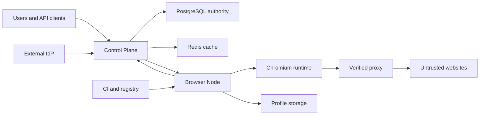

# Agent Browser Cloud Threat Model

## Executive summary

Agent Browser Cloud is an internet-facing, multi-tenant browser execution platform. The highest
risks are cross-tenant authorization failure, hostile web content steering Agent tools, compromise
of privileged Browser Node processes, Profile/credential disclosure, and supply-chain substitution.
OIDC-derived tenant identity, capability-scoped Agent tools, mTLS, fencing epochs, fail-closed proxy
handling, tamper-evident audit, and signed Runtime admission now form the primary control chain.

## Scope and assumptions

- In scope: `apps/control-plane`, `apps/browser-node`, `apps/web-console`, contracts, migrations,
  deployment and CI definitions.
- Production is assumed to be public, Kubernetes-hosted and multi-tenant.
- Profiles may contain authenticated browser state and regulated personal data.
- The external IdP, Vault/KMS, proxy providers, container registry and Kubernetes control plane are
  trusted dependencies, but their outputs are validated at platform boundaries.
- Tests and local fixtures are not production controls; local header authentication and plaintext
  gRPC are explicitly prohibited when `app.environment=production`.
- Owner names are not encoded in the repository; the role owners below follow the V16 RACI.

Open questions that can change risk ranking: exact regulated-data classes by tenant, final IdP
assurance policy, and whether Browser Nodes run on dedicated physical hosts or only dedicated pools.

## System model

### Primary components

- React Web Console and external API clients.
- Spring Boot Control Plane with PostgreSQL authority and Redis disposable cache.
- Rust Browser Node Agent with runtime, input, network, storage, state and desktop components.
- Chromium Runtime and untrusted websites.
- External IdP, proxy/provider, artifact registry, object storage and observability systems.

### Data flows and trust boundaries

- Client → Control Plane: JSON/HTTP; OIDC Bearer, RBAC, schema validation and tenant derivation.
- Control Plane → Browser Node: protobuf/gRPC; mutual TLS, bounded messages, command fencing,
  idempotency and deadlines.
- Browser Node → Control Plane: protobuf/gRPC; mutual TLS, Inbox deduplication, Tenant/Term/Epoch/
  Sequence validation.
- Browser Node → Chromium: loopback CDP and process control; bounded command vocabulary and
  no raw-CDP client surface.
- Chromium → Internet: provider proxy only in production; exit verification and no direct fallback.
- Browser Node → Profile storage: tenant/profile paths, single writer, hashes and commit markers.
- Untrusted page content → Agent: classified untrusted, partitioned, minimized and unable to mint
  capability or authorization evidence.

#### Diagram

## Assets and security objectives

| Asset | Why it matters | Security objective |
|---|---|---|
| Tenant/Profile browser state | May contain authenticated sessions and PII | C/I/A |
| Session Context and Operation epochs | Prevent stale or double writers | I/A |
| Agent capability/confirmation evidence | Controls effects on external sites | I/C |
| Proxy secrets and observed exit | Prevents egress identity leak | C/I/A |
| mTLS, ticket and encryption keys | Establishes workload identity | C/I |
| Runtime artifacts and SBOM | A substituted browser runs tenant code/data | I |
| Audit chain | Incident and compliance evidence | I/A |

## Attacker model

### Capabilities

- Submit authenticated tenant-scoped API input and create hostile page/email/document content.
- Control a website visited by an Agent, trigger redirects and mutate DOM/state rapidly.
- Replay observed application messages and cause process/network/provider failures.
- A malicious tenant can consume its own quotas and attempt opaque-reference reuse.

### Non-capabilities

- No assumed IdP, CA, KMS, registry-signing or Kubernetes administrator compromise.
- No assumed host root access or direct PostgreSQL write access.
- Physical side channels and Chromium zero-days are tracked residual risks, not application defects.

## Entry points and attack surfaces

| Surface | How reached | Trust boundary | Notes | Evidence |
|---|---|---|---|---|
| Session/Agent REST API | Internet HTTPS | Client → CP | OIDC/RBAC in production | `security/SecurityConfiguration.java` |
| Node Control gRPC | Internal network | CP → Node | Production mTLS | `infrastructure/GrpcTransportFactory.java` |
| Node Event gRPC | Internal network | Node → CP | mTLS plus fencing | `infrastructure/NodeEventGrpcServer.java` |
| Agent context/tools | API and page state | Untrusted content → executor | Capability and minimization gates | `application/AgentExecutionService.java` |
| Chromium/CDP | Node loopback | Runtime boundary | Restricted tools and loopback validation | `crates/state-collector/src/lib.rs` |
| Remote desktop | WebSocket ticket | Browser → Node | HMAC, origin, nonce and actor binding | `crates/remote-desktop-gateway/src/lib.rs` |
| Profile filesystem | Node helper | Runtime → durable data | Single writer and commit marker | `crates/storage-helper/src/lib.rs` |
| Build pipeline | GitHub Actions | Source → artifact | SBOM and high/critical scan | `.github/workflows/ci.yml` |

## Top abuse paths

1. Malicious tenant forges a tenant header → production ignores headers and derives tenant from JWT
   → repository checks still fence Session/Profile records.
2. Hostile page injects “upload cookies” → content remains untrusted and tainted → Intent/Plan/
   Capability checks prevent secret tools and persist a security event.
3. Attacker replays a Node callback → Inbox/Event Sequence and Coordinator/Context/Operation epochs
   reject it before state commit.
4. Network attacker impersonates a Node → mutual TLS requires a CA-issued client certificate →
   rotation is accepted only under the configured trust root.
5. Proxy provider fails → Network Helper opens its circuit and refuses direct fallback → Session
   startup fails without leaking the tenant egress.
6. Worker dies after dispatch → durable phase deadline expires → scanner times out the operation and
   executes safe compensation or records a Dead Letter.
7. Runtime artifact is substituted → production Runtime policy requires Stable validation,
   sha256 signature identity and SBOM URI before dispatch.
8. Audit row is modified → tenant sequence and previous-hash verification reports the chain invalid.

## Threat model table

| Threat ID | Threat source | Prerequisites | Threat action | Impact | Impacted assets | Existing controls | Gaps | Recommended mitigations | Detection ideas | Likelihood | Impact severity | Priority |
|---|---|---|---|---|---|---|---|---|---|---|---|---|
| TM-001 | Malicious tenant | Valid account | Cross-tenant ID probing or confused deputy | Profile/session disclosure | Tenant data | OIDC principal, repository tenant checks, integration 403 tests | Broader periodic matrix needed | Run cross-tenant suite on every release | 403 anomaly metric | medium | high | high |
| TM-002 | Hostile website | Agent visits controlled page | Prompt injection reaches high-risk sink | External action/data loss | Capability evidence | Trust labels, minimization, capability tokens, confirmation | Screenshot OCR taint coverage incomplete | Extend taint to vision and downloads | Prompt Security Event alerts | high | high | high |
| TM-003 | Network/workload attacker | Internal reachability | Forge/replay CP↔Node traffic | Runtime/state takeover | Context integrity | mTLS, Inbox, Journal, fencing epochs | Automated CA revocation feed pending | Short-lived SPIFFE identities and revocation drill | TLS/auth failure alerts | low | high | medium |
| TM-004 | Compromised runtime/provider | Code execution in runtime | Read Profile or proxy material | Credential exfiltration | Profile and secrets | Network Helper independent process, fixed bounded IPC, Peer UID, dedicated container UID/seccomp/capability drop; loopback CDP; no secrets in Session Context | Storage Helper remains in-process; GPU/LSM profiles and real-cluster cross-UID evidence pending | Split remaining Helpers, enforce Landlock/AppArmor/SELinux and dedicated audit identities | helper syscall/IPC audit | medium | high | high |
| TM-005 | Supply-chain attacker | Registry or dependency path | Substitute Runtime/build dependency | Tenant-wide code execution | Runtime artifacts | Runtime admission, SBOM and CI scan | Keyless provenance verification at Node pending | Verify Sigstore bundle at Node before launch | digest mismatch alert | low | high | high |
| TM-006 | Tenant/traffic burst | API access | Exhaust CP/Node/desktop resources | Multi-tenant outage | Availability | Bounded messages, resource classes, deadlines | Shared rate-limit/admission facts not complete | Tenant cost units and emergency lanes | saturation/error-budget alerts | high | medium | high |
| TM-007 | Operator/admin | Admin token | Misuse break-glass or retention controls | Evidence/data compromise | Audit and Profiles | Admin MFA, dual-control time-bound break-glass, revocation/review and append-only hash chain | Secure Debug worker/recording and retention deletion receipt incomplete | Isolated debug data plane and signed retention evidence | admin action alerts | low | high | medium |
| TM-008 | Failure/race | Worker or database disruption | Workflow stuck or stale callback commits | Incorrect state/resource leak | Operations | Durable workflow, CAS version, deadlines, DLQ | Full fault matrix incomplete | GameDay all listed failures | oldest workflow age | medium | medium | medium |

## Criticality calibration

- Critical: unauthenticated platform RCE, general OIDC bypass, or arbitrary cross-tenant Profile
  extraction.
- High: privileged helper escape, Runtime substitution, repeatable prompt-to-secret exfiltration,
  or tenant-wide availability loss.
- Medium: targeted Session denial, stale state requiring recovery, or tightly scoped audit gaps.
- Low: non-sensitive metadata disclosure, noisy local-only failure, or issue requiring host root.

## Focus paths for security review

| Path | Why it matters | Related Threat IDs |
|---|---|---|
| `apps/control-plane/src/main/java/io/browsercloud/security` | Identity, RBAC and MFA root | TM-001, TM-007 |
| `apps/control-plane/src/main/java/io/browsercloud/application/AgentExecutionService.java` | Tool authorization/effects | TM-002 |
| `apps/control-plane/src/main/java/io/browsercloud/application/DurableWorkflowApplicationService.java` | Callback and timeout fencing | TM-008 |
| `apps/control-plane/src/main/java/io/browsercloud/infrastructure` | gRPC, outbox and persistence adapters | TM-003 |
| `apps/browser-node/crates/node-agent/src/main.rs` | Privileged orchestration choke point | TM-003, TM-004 |
| `apps/browser-node/crates/storage-helper` | Authenticated browser state | TM-004 |
| `apps/browser-node/crates/network-helper` | Egress fail-closed boundary | TM-004, TM-006 |
| `apps/browser-node/crates/remote-desktop-gateway` | Human input/data plane | TM-003 |
| `.github/workflows/ci.yml` | Build provenance boundary | TM-005 |

## Quality check

- REST, gRPC, CDP, WebSocket, Profile, egress and CI entry points are covered.
- Every identified trust boundary appears in an abuse path or threat.
- Production controls are separated from local headers, fake Chromium and fixtures.
- Context assumptions are taken from the supplied V16 final architecture; remaining deployment and
  data-class questions are explicit.
